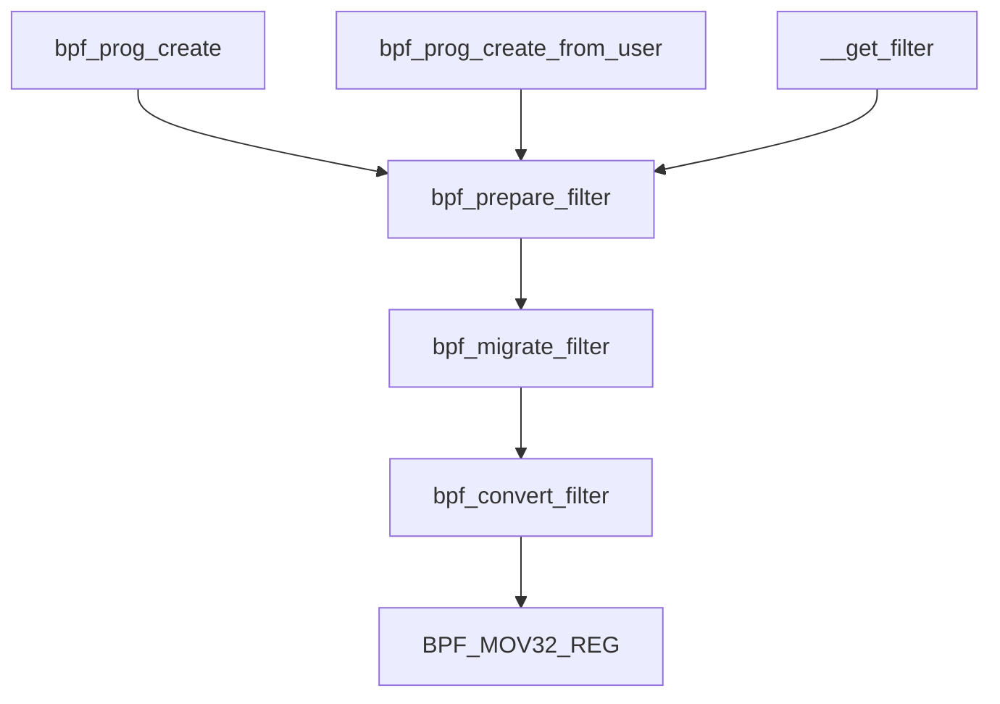

# Extend Berkeley Packet Filter
 eBPF is used extensively to drive a wide variety of use cases: <br>
 * Providing high-performance networking and load-balancing in modern data centers and cloud native environments.
 * extracting fine-grained security observability data at low overhead.
 * [helping application developers trace applications](#code_tracing).
 * providing insights for performance troubleshooting.
 * preventive application and container runtime security enforcement.<br>
see [epbf.io](https://ebpf.io/) for more information.<br>


<h2 id="code_tracing"> Code Tracing</h2>

Before understand how ebpf work at kernel code tracing, serval samples linux provide is necessary to take a look.<br>
* Show packet information when receive packet from `lo` interface. <br>
    `linux/sample/tracex1_kern.c`
    ```c
    #define _(P) ({typeof(P) val = 0; bpf_probe_read(&val, sizeof(val), &P); val;})
    SEC("kprobe/__netif_receive_skb_core")
    int bpf_prog1(struct pt_regs *ctx) {
        char devname[IFNAMSIZ];
        struct net_device *dev;
        struct sk_buff *skb;
        int len;

        skb = (struct sk_buff *) PT_REGS_PARM1(ctx);
        dev = _(skb->dev);
        len = _(skb->len);

        bpf_probe_read(devname, sizeof(devname), dev->name);

        if (devname[0] == 'l' && devname[1] == 'o') {
            char fmt[] = "skb %p len %d\n";
            bpf_trace_printk(fmt, sizeof(fmt), skb, len);
        }

        return 0;
    }
    ```
    `linux/sample/tracex1_user.c`
    ```c
    int main(int ac, char **argv) {
        FILE *f;
        char filename[256];

        snprintf(filename, sizeof(filename), "%s_kern.o", argv[0]);

        if (load_bpf_file(filename)) {
            printf("%s", bpf_log_buf);
            return 1;
        }

        f = open("taskset 1 ping -c5 localhost", "r");
        (void) f;

        read_trace_pipe();
        return 0;
    }
    ```
The bpf program `tracex1_kern` will be compiled to object file, then user can inject those program to kernel by calling function `load_bpf_file()`.<br>
Those samples provide us some clues to know how ebpf working.<br>
let's start first from function `load_bpf_file().`

```c
int load_bpf_file(char *path) {
    return do_load_bpf_file(path, NULL);
}
```
<details><summary>do_load_bpf_file()</summary>
<p>

The process of `do_load_bpf_file()` divided into 
* Open object file by elf format.
* Extract necessary information from elf file
* attach bpf program to corresponding process.
```c
static int do_load_bpf_file(const char *path, fixup_map_cb fixup_map) {
    int fd, i, ret, maps_shndx = -1, strtabidx = -1;
    Elf *elf;
    GElf_Ehdr ehdr;
    GElf_Shdr shdr, shdr_prog;
    Elf_Data *data, *data_prog, *data_maps = NULL, *symbols = NULL;
    char *shname, *shname_prog;
    int nr_maps = 0;
        ...
    fd = open(path, O_RDONLY, 0);
    if (fd < 0)
        return 1;

    elf = elf_begin(fd, ELF_C_READ, NULL);

    if (!elf)
        return 1;

    if (gelf_getehdr(elf, &ehdr) != &ehdr)
        return 1;

    /* clear all kprobes */
    i = write_kprobe_events("");

    /* scan over all elf sections to get license and map info */
    for (i = 1; i < ehdr.e_shnum; i++) {

        if (get_sec(elf, i, &ehdr, &shname, &shdr, &data))
            continue;

        if (strcmp(shname, "license") == 0) {
            processed_sec[i] = true;
            memcpy(license, data->d_buf, data->d_size);
        } else if (strcmp(shname, "version") == 0) {
            processed_sec[i] = true;
            if (data->d_size != sizeof(int)) {
                printf("invalid size of version section %zd\n",
                       data->d_size);
                return 1;
            }
            memcpy(&kern_version, data->d_buf, sizeof(int));
        } else if (strcmp(shname, "maps") == 0) {
            int j;

            maps_shndx = i;
            data_maps = data;
            for (j = 0; j < MAX_MAPS; j++)
                map_data[j].fd = -1;
        } else if (shdr.sh_type == SHT_SYMTAB) {
            strtabidx = shdr.sh_link;
            symbols = data;
        }
    }

    ret = 1;

    if (!symbols) {
        printf("missing SHT_SYMTAB section\n");
        goto done;
    }

    if (data_maps) {
        nr_maps = load_elf_maps_section(map_data, maps_shndx,
                        elf, symbols, strtabidx);
        if (nr_maps < 0) {
            printf("Error: Failed loading ELF maps (errno:%d):%s\n",
                   nr_maps, strerror(-nr_maps));
            goto done;
        }
        if (load_maps(map_data, nr_maps, fixup_map))
            goto done;
        map_data_count = nr_maps;

        processed_sec[maps_shndx] = true;
    }

    /* process all relo sections, and rewrite bpf insns for maps */
    for (i = 1; i < ehdr.e_shnum; i++) {
        if (processed_sec[i])
            continue;

        if (get_sec(elf, i, &ehdr, &shname, &shdr, &data))
            continue;
        if (shdr.sh_type == SHT_REL) {
            struct bpf_insn *insns;

            /* locate prog sec that need map fixup (relocations) */
            if (get_sec(elf, shdr.sh_info, &ehdr, &shname_prog,
                    &shdr_prog, &data_prog))
                continue;

            if (shdr_prog.sh_type != SHT_PROGBITS ||
                !(shdr_prog.sh_flags & SHF_EXECINSTR))
                continue;

            insns = (struct bpf_insn *) data_prog->d_buf;
            processed_sec[i] = true; /* relo section */

            if (parse_relo_and_apply(data, symbols, &shdr, insns,
                         map_data, nr_maps))
                continue;
        }
    }

    /* load programs */
    for (i = 1; i < ehdr.e_shnum; i++) {

        if (processed_sec[i])
            continue;

        if (get_sec(elf, i, &ehdr, &shname, &shdr, &data))
            continue;

        if (memcmp(shname, "kprobe/", 7) == 0 ||
            memcmp(shname, "kretprobe/", 10) == 0 ||
            memcmp(shname, "tracepoint/", 11) == 0 ||
            memcmp(shname, "raw_tracepoint/", 15) == 0 ||
            memcmp(shname, "xdp", 3) == 0 ||
            memcmp(shname, "perf_event", 10) == 0 ||
            memcmp(shname, "socket", 6) == 0 ||
            memcmp(shname, "cgroup/", 7) == 0 ||
            memcmp(shname, "sockops", 7) == 0 ||
            memcmp(shname, "sk_skb", 6) == 0 ||
            memcmp(shname, "sk_msg", 6) == 0) {
            ret = load_and_attach(shname, data->d_buf,
                          data->d_size);
            if (ret != 0)
                goto done;
        }
    }

done:
    close(fd);
    return ret;
}
```
</p></details>

`load_and_attach()` -> `bpf_load_program()` -> `bpf_load_program_xattr()` -> `sys_bpf_prog_load()`
```c
static inline int sys_bpf_prog_load(union bpf_attr *attr, unsigned int size) {
    int fd;

    do {
        fd = sys_bpf(BPF_PROG_LOAD, attr, size);
    } while( fd < 0 && errno == EAGAIN);

    return fd;
}

static inline int sys_bpf(enum bpf_cmd cmd, union bpf_attr *attr, unsigned int size) {
    return syscall(__NR_bpf, cmd, attr, size);
}

SYSCALL_DEFINE3(bpf, int, cmd, union bpf_attr __user *, uattr, unsigned int, size) {
        ...
    switch(cmd) {
            ...
    case BPF_PROG_LOAD:
        err = bpf_prog_load(&attr, uattr);
        break;
            ...
    }
        ...
}
```
```c
static int bpf_prog_load(union bpf_attr *attr, union bpf_attr __user *uattr) {
    enum bpf_prog_type type = attr->prog_type;
    struct bpf_prog *prog;
        ...
    err = find_prog_type(type, prog);
}

static int find_prog_type(enum bpf_prog_type type, struct bpf_prog *prog) {
    const struct bpf_prog_ops *ops;

    ops = bpf_prog_types[type];

    if (!bpf_prog_is_dev_bound(prog->aux))
        prog->aux->ops = ops;
    else
        prog->aux->ops = &bpf_offload_prog_ops;
    prog->type = type;
    return 0;
}
```

## Reference
* [ELF文件解析](https://www.cnblogs.com/jiqingwu/p/elf_format_research_01.html)
## tmp

The main feature of eBPF are : <br>
* Packet Filter (replace `cBPF`).
* Code Tracing.

### Packet filter
The initialize function `bpf_init_module()` at the `net/sched/ach_bpf.c` seem to replace class bpf feature ?<br>

### Code Tracing
`tracing_func_proto()` 
```c
const struct bpf+verifier_ops kprobe_verifier_ops = {
    .get_func_proto = kprobe_prog_func_proto,
    .is_valid_access = kprobe_prog_is_valid_access,
};

static const struct bpf_verifier_ops * const bpf_verifier_ops[] = {
#define BPF_PROG_TYPE(_id, _name) \
    [_id] = & _name ## _verifier_ops,
#define BPF_MAP_TYPE(_id, _ops)
#include <linux/bpf_type.h>
#undef BPF_PROG_TYPE
#undef BPF_MAP_TYPE
}
```
In `include/linux/bpf_type.h`
```c
    ...
BPF_PROG_TYPE(BPF_PROG_TYPE_KPROBE, kprobe)
    ...
```

load BPF file
```c
int load_bpf_file(char *path) {
    return do_load_bpf_file(path, NULL);
}
```