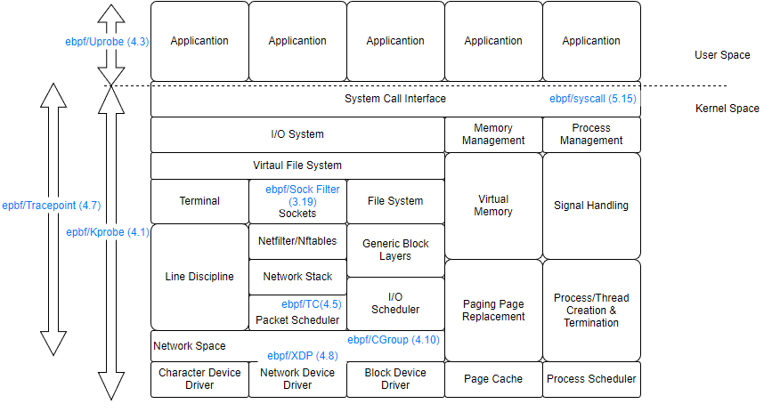
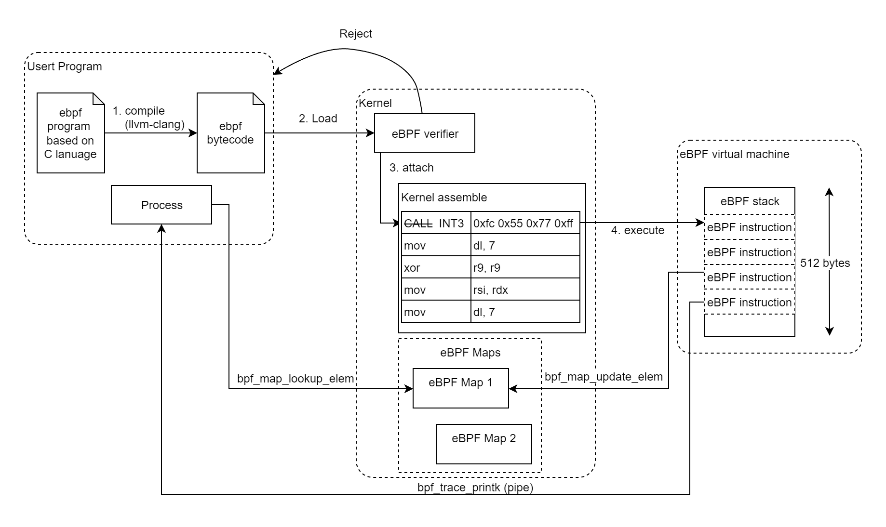
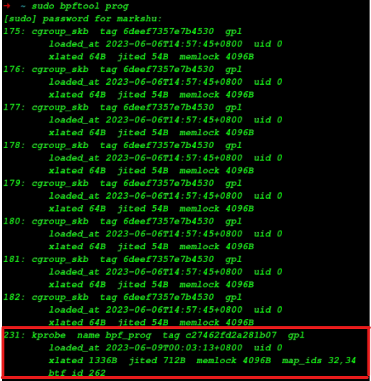
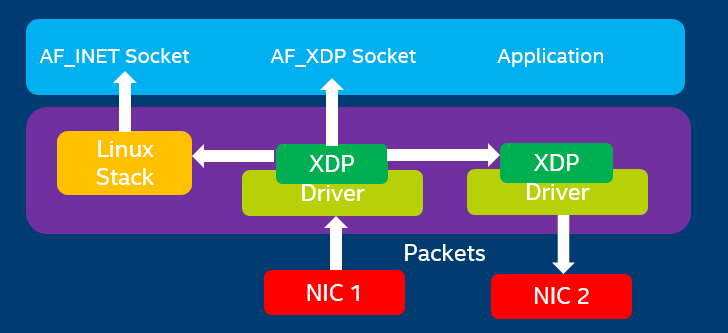

# eBPF Introduction

eBPF(Extended Berkeley Packet Filter) enables the dynamic insertion of code into the linux kernel without requiring modifications or recompilation.<br>
The eBPF technology was initially introduced as a replacement for BPF(Berkeley Packet Filter). However, it has evloved into a comprehensive framework that enables programmers to interact with a wide array of modules.<br>
After the success of eBPF, eventually, the BPF was replaced by eBPF fully and renamed to cBPF (classic Berkelay Packet Filter).<br><br>
<br>

## Component

The eBPF was consisted by `eBPF Verifer`, `eBPF JIT Compiler`, `eBPF Virtual Machine` and `eBPF Maps`.<br>
<br>

In order to ensure the safty of eBPF program, the `eBPF Verifer` checks the absence of loops and ensure the prevection of kernel panics.<br>
```
The safety of the eBPF program is determined in two steps.
First step does DAG check to disallow loops and other CFG validation. In particular it will detect programs that have unreachable instructions. (though classic BPF checker allows them)
Second step starts from the first insn and descends all possible paths. It simulates execution of every insn and observes the state change of registers and stack.
                                                                                                                             ———————— The Linux Kernel Document, eBPF verifier chapter
```
Furthermore, the eBPF program was executed in virtual machine actually. This sandbox approach allows programs deeper levels of access into kernel operations without increasing the risk of harm to the system.<br>
In order to facilitate data exchange between userspace and kernel space, the inclusion of the `eBPF Maps` structure was implemented. <br>
For the sake of efficiency, eBPF offers various types of maps including hash, array, ring buffer, queue, and so on. See `linux/include/linux/bpf_types.h` for details information.<br>

## eBPF Program Manage Tool
The `bpftool` is provided by linux official allows user to interact with eBPF subsystem. The tool can manage eBPF programs, maps, and other eBPF-related entities.<br>
User can manipulate eBPF instructions, such as `list`, `load`, `attach`, `deattch`, and other, using this tool.<br> 
### List



## Interact Module

### Probe module : kprobe, uprobe

Those module allows user set the probe point in kernel and userspace process. When target function push into stack, the `CALL` instruction (0xe8) will be replaced with `INT3` (0xcc). After `INT3` instruction was executed, the value of all registers will be copied to the stack in eBPF virtucal machine.<br>
<br>

User can obtain the execute information via the reading those registers. Beside, eBPF provides a macro set to access those registers which is called `eBPF helper`.
```c
tools/lib/bpf/bpf_tracing.h
#define PT_REGS_PARM1(x) (__PT_REGS_CAST(x)->__PT_PARM1_REG)
#define PT_REGS_PARM2(x) (__PT_REGS_CAST(x)->__PT_PARM2_REG)
#define PT_REGS_PARM3(x) (__PT_REGS_CAST(x)->__PT_PARM3_REG)
#define PT_REGS_PARM4(x) (__PT_REGS_CAST(x)->__PT_PARM4_REG)
#define PT_REGS_PARM5(x) (__PT_REGS_CAST(x)->__PT_PARM5_REG)
#define __PT_PARM1_REG rdi
#define __PT_PARM2_REG rsi
#define __PT_PARM3_REG rdx
#define __PT_PARM4_REG rcx
#define __PT_PARM5_REG r8
```
The below example shows how to obtain the PTK in the Wi-Fi associate process.<br>
The function `ieee80211_key_alloc` is used to allocate a `ieee80211_key` instance and populate the key field by 4th parameter.<br>  
```c
linux/net/mac80211/key.c
/*** ieee80211_key_alloc
* @param1 chiper
* @param2 idx
* @param3 key_len
* @param4 key_data
* @param5 seq_len
* @param6 seq
* @param7 cs
* @Return : the pointer of ieee80211_key structure.
* */
struct ieee80211_key *
ieee80211_key_alloc(u32 cipher, int idx, size_t key_len,
                    const u8 *key_data,
                    size_t seq_len, const u8 *seq,
                    const struct ieee80211_cipher_scheme *cs);
```
<details><summary>epbf program</summary>
<p>

```c
SEC("kprobe/ieee80211_key_alloc")
int bpf_prog(struct pt_regs *ctx) {
        int key_index = (int)PT_REGS_PARM2(ctx);
        size_t key_len = (size_t)PT_REGS_PARM3(ctx);
        u8 *key_data = (u8 *)PT_REGS_PARM4(ctx);

        u64 *key_data_format = (u64 *)key_data;
        struct ieee_80211_encrypt_key key = {0};
        key.key_len = key_len;
        temporary_key_copy(key_data, key_len, key.key_data, TK_LENGTH);

        bpf_map_update_elem(&key_map, &key_index, &key, BPF_ANY);
        char fmt[] = "ieee80211_key_alloc: key index %ld\n\t%llx %llx";
        if (key_data)
                bpf_trace_printk(fmt, sizeof(fmt), key_index, KEY2STR(key_data_format));
        else
                bpf_trace_printk(fmt, sizeof(fmt), key_index, 0xff);
        return 0;
}

char _license[] SEC("license") = "GPL";
u32 _version SEC("version") = LINUX_VERSION_CODE;
```
</p></details>

<details><summary>user space program</summary>
<p>

```c
#include <stdio.h>
#include <linux/bpf.h>
#include <bpf/libbpf.h>
#include <sys/syscall.h>

struct ieee_80211_encrypt_key {
        __u8 key_data[16];
        size_t key_len;
};

static void foreach_key_map(int map) {
        __u64 key, next_key;
        struct ieee_80211_encrypt_key encrypt;

        if (map < 0) return;
        key = -1;
        while (bpf_map_get_next_key(map, &key, &next_key) == 0) {
                bpf_map_lookup_elem(map, &next_key, &encrypt);
                key = next_key;
                printf("obj 0x%llx, key %lx %lx\n", next_key,
                                *(__u64 *)&(encrypt.key_data[0]), *(__u64 *)&(encrypt.key_data[8]));
        }
}

int main(int argc, char **argv) {
        struct bpf_object *obj;
        struct bpf_program *prog;
        char filename[256];
        struct bpf_link *link = NULL;

        snprintf(filename, sizeof(filename), "wifi_key_query_kern.o");

        obj = bpf_object__open_file(filename, NULL);
        if (libbpf_get_error(obj)) {
                fprintf(stderr, "ERROR : opening BPF object file failed\n");
                return 0;
        }
        prog = bpf_object__find_program_by_name(obj, "bpf_prog");
        if (!prog) {
                fprintf(stderr, "ERROR: ebpf program not found\n");
                goto cleanup;
        }

        if (bpf_object__load(obj)) {
                fprintf(stderr, "ERROR: loading BPF object file failed\n");
                goto cleanup;
        }
        link = bpf_program__attach(prog);
        if (libbpf_get_error(link)) {
                fprintf(stderr, "ERROR: bpf_program__attach failed\n");
                link = NULL;
                goto cleanup;
        }
        int map_fd = bpf_object__find_map_fd_by_name(obj, "key_map");
        if (map_fd <= 0) {
                fprintf(stderr, "map not found\n");
                goto cleanup;
        }
        while(1) {
                foreach_key_map(map_fd);
                sleep(1);
        }
cleanup:
        bpf_link__destroy(link);
        bpf_object__close(obj);
        return 0;
}
```
</p></details>

[](https://www.youtube.com/watch?v=DwHDxK9kTIw)

### Traffic Controller (TC)
With TC, developer can enforce quality of service(QoS) policies, allocate bandwidth to different applicantions and manage network congetion.<br>
It's commonly used in scenarios where there is need to prioritize certain types of traffic.<br>
See [Traffic Controller](./packet_schedule.md) for more information.<br>
<image src="./picture/packet_schedule/pfifo_fast_enqueue.png" width=300px><br>

### Express Data Path (XDP)
`XDP` is a high-performance network programming framework. It was designed for performing packet processing and filter at the earliest stage (in front of the network stack).<br>
`XDP` operates at the network driver level, even before the `sk_buff` allocation. So it provides a highly efficient incoming packets handles. It also is a commonly soulation for defending against DDos attacks.<br>


### Control Groups (cgroups)
`cgroups` are a feature of the kernel that provides resource isolation and allocation for process and their associated resources.<br>
This subsystem allow user to manage and allocate system resource such as CPU, memory, disk IO, and network bandwidth among groups of processes.<br>

## Security

`With great power there must also come great responsibility ———— eBPF FOUNDATION`<br>
The safety of eBPF is ensured through several layers:
1. Required Privileges<br>
   Unless unprivileged eBPF is enabled, all processes that intend to load eBPF programs must be unning in root mode or require the capability `CAP_BPF`.
2. Verifier<br>
   Before loading eBPF program, all programs should pass through the eBPF verifier. The eBPF verifier ensures the safety of the program itself.
3. Signature<br>
   The signature feature was merged into linux kernel in 12/2021 ([patch](https://lwn.net/Articles/877638/)), Enabling eBPF signature verifier by enable the kernel config `BPF_SIG`.<br>

## Conclusion
With the continuous expansion of the eBPF subsystem, eBPF has become a framework for connecting the increasingly complex functional modules within the Linux kernel.<br>
Users can connect these modules by reading the eBPF manual and utilizing eBPF helpers, without needing to delve into the details of each module's usage.<br>
Furthermore, due to the hot-plugin nature of eBPF and its comprehensive control interface, developers can dynamically and easily adjust network policies and observe system operation.<br>
