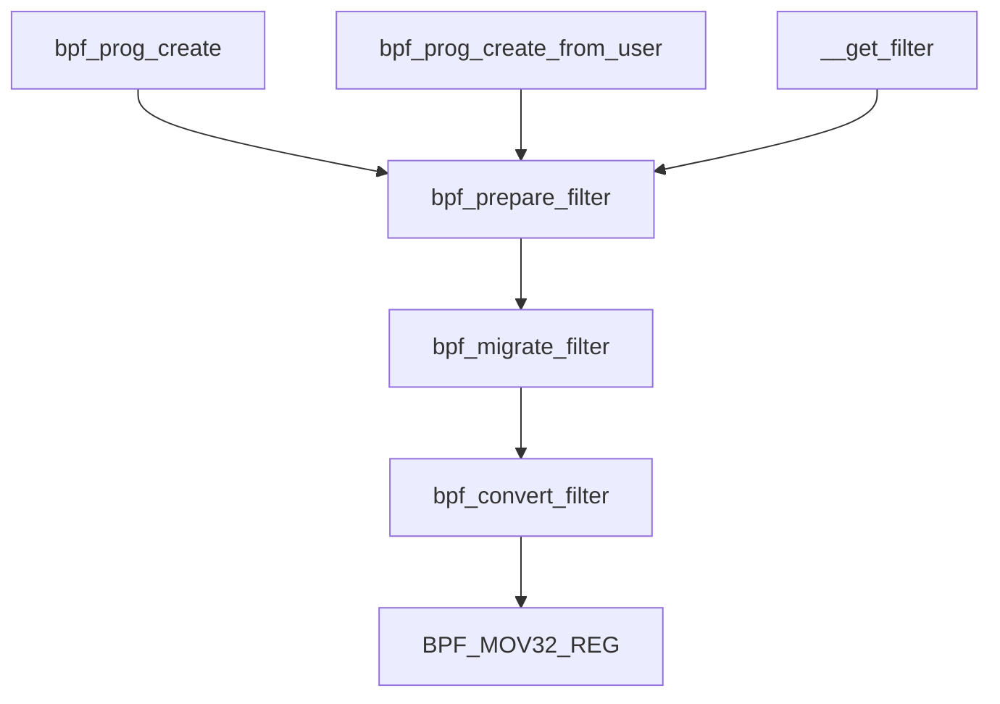

# Extend Berkeley Packet Filter
 eBPF is used extensively to drive a wide variety of use cases: <br>
 * Providing high-performance networking and load-balancing in modern data centers and cloud native environments.
 * extracting fine-grained security observability data at low overhead.
 * [helping application developers trace applications](#code_tracing).
 * providing insights for performance troubleshooting.
 * preventive application and container runtime security enforcement.<br>
see [epbf.io](https://ebpf.io/) for more information.<br>


<h2 id="code_tracing"> Code Tracing</h2>

Before understand how ebpf work at kernel code tracing, that's a samples linux provide is necessary to take a look.<br>
Show packet information when receive packet from `lo` interface. <br>
`linux/sample/bpf/tracex1_kern.c`
```c
#define _(P) ({typeof(P) val = 0; bpf_probe_read(&val, sizeof(val), &P); val;})
SEC("kprobe/__netif_receive_skb_core")
int bpf_prog1(struct pt_regs *ctx) {
    char devname[IFNAMSIZ];
    struct net_device *dev;
    struct sk_buff *skb;
    int len;

    skb = (struct sk_buff *) PT_REGS_PARM1(ctx);
    dev = _(skb->dev);
    len = _(skb->len);

    bpf_probe_read(devname, sizeof(devname), dev->name);

    if (devname[0] == 'l' && devname[1] == 'o') {
        char fmt[] = "skb %p len %d\n";
        bpf_trace_printk(fmt, sizeof(fmt), skb, len);
    }

    return 0;
}
```
`linux/sample/bpf/tracex1_user.c`
```c
int main(int ac, char **argv) {
    FILE *f;
    char filename[256];

    snprintf(filename, sizeof(filename), "%s_kern.o", argv[0]);

    if (load_bpf_file(filename)) {
        printf("%s", bpf_log_buf);
        return 1;
    }

    f = open("taskset 1 ping -c5 localhost", "r");
    (void) f;

    read_trace_pipe();
    return 0;
}
```
The bpf program `tracex1_kern` will be compiled to ELF file, then user can inject those program to kernel by calling function `load_bpf_file()`.<br>
Those samples provide us some clues to know how ebpf working.<br>
Let's start first at function `load_bpf_file().`

```c
int load_bpf_file(char *path) {
    return do_load_bpf_file(path, NULL);
}
```
<details><summary>do_load_bpf_file()</summary>
<p>

The process of `do_load_bpf_file()` divided into 
* Open object file by elf format.
* Extract necessary information from elf file
* attach bpf program to corresponding process.

```c
static int do_load_bpf_file(const char *path, fixup_map_cb fixup_map) {
            ...
    fd = open(path, O_RDONLY, 0);
            ...
    elf = elf_begin(fd, ELF_C_READ, NULL);

    if (gelf_getehdr(elf, &ehdr) != &ehdr)
        return 1;
            ...
    /* process all relo sections, and rewrite bpf insns for maps */
    for (i = 1; i < ehdr.e_shnum; i++) {
        if (processed_sec[i])
            continue;

        if (get_sec(elf, i, &ehdr, &shname, &shdr, &data))
            continue;
        if (shdr.sh_type == SHT_REL) {
            struct bpf_insn *insns;

            /* locate prog sec that need map fixup (relocations) */
            if (get_sec(elf, shdr.sh_info, &ehdr, &shname_prog,
                    &shdr_prog, &data_prog))
                continue;

            if (shdr_prog.sh_type != SHT_PROGBITS ||
                !(shdr_prog.sh_flags & SHF_EXECINSTR))
                continue;

            insns = (struct bpf_insn *) data_prog->d_buf;
            processed_sec[i] = true; /* relo section */

            if (parse_relo_and_apply(data, symbols, &shdr, insns,
                        map_data, nr_maps))
                continue;
        }
    }

    /* load programs */
    for (i = 1; i < ehdr.e_shnum; i++) {

        if (processed_sec[i])
            continue;

        if (get_sec(elf, i, &ehdr, &shname, &shdr, &data))
            continue;

        if (memcmp(shname, "kprobe/", 7) == 0 ||
            memcmp(shname, "kretprobe/", 10) == 0 ||
            memcmp(shname, "tracepoint/", 11) == 0 ||
            memcmp(shname, "raw_tracepoint/", 15) == 0 ||
            memcmp(shname, "xdp", 3) == 0 ||
            memcmp(shname, "perf_event", 10) == 0 ||
            memcmp(shname, "socket", 6) == 0 ||
            memcmp(shname, "cgroup/", 7) == 0 ||
            memcmp(shname, "sockops", 7) == 0 ||
            memcmp(shname, "sk_skb", 6) == 0 ||
            memcmp(shname, "sk_msg", 6) == 0) {
            ret = load_and_attach(shname, data->d_buf,
                        data->d_size);
            if (ret != 0)
                goto done;
        }
    }

done:
    close(fd);
    return ret;
}
```

Function `load_and_attach()` divide into two part, load BPF program from `ELF` file and attach the program to specific code.<br>
* Load BPF program.<br>
    `load_and_attach()` -> `bpf_load_program()` -> `bpf_load_program_xattr()` -> `sys_bpf_prog_load()`
    ```c
    static inline int sys_bpf_prog_load(union bpf_attr *attr, unsigned int size) {
        int fd;

        do {
            fd = sys_bpf(BPF_PROG_LOAD, attr, size);
        } while( fd < 0 && errno == EAGAIN);

        return fd;
    }

    static inline int sys_bpf(enum bpf_cmd cmd, union bpf_attr *attr, unsigned int size) {
        return syscall(__NR_bpf, cmd, attr, size);
    }

    SYSCALL_DEFINE3(bpf, int, cmd, union bpf_attr __user *, uattr, unsigned int, size) {
            ...
        switch(cmd) {
                ...
        case BPF_PROG_LOAD:
            err = bpf_prog_load(&attr, uattr);
            break;
                ...
        }
            ...
    }
    ```

        
    After extract data from ELF file, calling `bpf` system call to inject BPF program to kernel.<br>
    ```c
    static int bpf_prog_load(union bpf_attr *attr, union bpf_attr __user *uattr) {
        enum bpf_prog_type type = attr->prog_type;
        struct bpf_prog *prog;
            ...
        prog = bpf_prog_alloc(bpf_prog_size(attr->insn_cnt), GFP_USER);
            ...
        err = security_bpf_prog_alloc(prog->aux);
            ...
        if (copy_from_user(prog->insns, u64_to_user_ptr(attr->insns),
                bpf_prog_insn_size(prog)) != 0)
                goto free_prog;
            ...
        err = find_prog_type(type, prog);
            ...
        prog = bpf_prog_select_runtime(prog, &err);
            ...
        err = bpf_prog_alloc_id(prog);
            ...
        bpf_prog_kallsyms_add(prog);
        perf_event_bpf_event(prog, PERF_BPF_EVENT_PROG_LOAD, 0);

        err = bpf_prog_new_fd(prog);
        if (err < 0)
            bpf_prog_put(prog);
        return err;
    }
    ``` 
    <details><summary>find_prog_type</summary>
    <p>

    ```c
    static int find_prog_type(enum bpf_prog_type type, struct bpf_prog *prog) {
        const struct bpf_prog_ops *ops;

        ops = bpf_prog_types[type];

        if (!bpf_prog_is_dev_bound(prog->aux))
            prog->aux->ops = ops;
        else
            prog->aux->ops = &bpf_offload_prog_ops;
        prog->type = type;
        return 0;
    }
    ```
    </p></details>

    <details><summary>perf_event_bpf_event</summary>
    <p>

    `bpf_prog_load()` -> `perf_event_bpf_event()` -> `perf_event_bpf_emit_ksymbols()` -> `perf_iterate_sb()` -> `perf_iterate_sb_cpu()`<br>
    I believe that `perf_event_bpf_event()` is a function used to notifiy matched `perf_event` that new bpf program is registered.<br>
    Those matched `perf_event` is registered by system call `perf_event_open()` at userspace.<br>
    ```c
    void perf_event_bpf_event(struct bpf_prog *prog,
                enum perf_bpf_event_type type, u16 flags) {
                ...
        switch (type) {
        case PERF_BPF_EVENT_PROG_LOAD:
        case PERF_BPF_EVENT_PROG_UNLOAD:
            if (atomic_read(&nr_ksymbol_events))
                perf_event_bpf_emit_ksymbols(prog, type);
            break;
        default:
            break;
        }
            ...
        bpf_event = (struct perf_bpf_event){
            .prog = prog,
            .event_id = {
                .header = {
                    .type = PERF_RECORD_BPF_EVENT,
                    .size = sizeof(bpf_event.event_id),
                },
                .type = type,
                .flags = flags,
                .id = prog->aux->id,
            },
        };
            ...
        perf_iterate_sb(perf_event_bpf_output, &bpf_event, NULL);
    }

    static void perf_iterate_sb_cpu(perf_iterate_f output, void *data) {
        struct pmu_event_list *pel = this_cpu_ptr(&pmu_sb_events);
        struct perf_event *event;

        list_for_each_entry_rcu(event, &pel->list, sb_list) {
            if (!smp_load_acquire(&event->ctx))
                continue;
            if (event->state < PERF_EVENT_STATE_INACTIVE)
                continue;
            if (!event_filter_match(event))
                continue;
            output(event, data);
        }
    }
    ```
    We can find out if a `perf_evnet` want to receive this notification, it must match serval rule by tracing the function `event_filter_match()`.<br>
    * `perf_event` registered with no cpu restrict (cpu == -1) or the specific cpu is matched.<br>
    * At same group (If kernel compile option `CONFIG_CGROUP_PERF` is enabled)<br>
    * Match the filter rule.<br> 
    ```c
    static inline int
    event_filter_match(struct perf_event *event)
    {
        return (event->cpu == -1 || event->cpu == smp_processor_id()) &&
            perf_cgroup_match(event) && pmu_filter_match(event);
    }
    ```
    Since the same type `perf_event` sharing the same `PMU`(performance monitor unit), the filter rule is depend on the type of `perf_event`. see function `perf_init_event()` for more information.<br>
    I thinks the `PMU` was register at kernel init process.<br>
    For example, `PERF_TYPE_SOFTWARE` type PMU.<br>
    ```c
    kernel/events/core.c
    void __init perf_event_init(void) {
            ...
        perf_pmu_register(&perf_swevent, "software", PERF_TYPE_SOFTWARE);
            ...
    }

    static struct pmu perf_swevent = {
        .task_ctx_nr    = perf_sw_context,
        .capabilities   = PERF_PMU_CAP_NO_NMI,
        .event_init     = perf_swevent_init,
        .add            = perf_swevent_add,
        .del            = perf_swevent_del,
        .start          = perf_swevent_start,
        .stop           = perf_swevent_stop,
        .read           = perf_swevent_read,
    };
    ```


    The data structure `pmu_sb_events` is a per-cpu variable, it means that each CPU has the `pmu_sb_events` instance.<br>
    The define of `pmu_sb_events` as below:<br>
    ```c
    kernel/events/core.c
    static DEFINE_PER_CPU(struct pmu_event_list, pmu_sb_events);
    ```
    So the function `this_cpu_ptr()` means that fetch the variable instance at this cpu.<br>
    See [Per-cpu 變量](https://xinqiu.gitbooks.io/linux-insides-cn/content/Concepts/linux-cpu-1.html) for more information.
    </p></details>
    <details><summary>bpf_prog_new_fd</summary>
    <p>

    ```c
    int bpf_prog_new_fd(struct bpf_prog *prog) {
        int ret;

        ret = security_bpf_prog(prog);
        if (ret < 0)
            return ret;

        return anon_inode_getfd("bpf-prog", &bpf_prog_fops, prog,
                O_RDWR | O_CLOEXEC);
    }
    ```
    </p></details>
    Easy to understand the `bpf` system call is used to create a `struct bpf_prog` instance, then return a corresponding file descriptor to caller.<br><br>
* Attach BPF program to corresponding source code<br>
    the attach method depend on event type define at the section of BPF program file, for the file `tracex1_kern.c`, the event type is `kprobe/__netif_receive_skb_core`<br>
    So that's take a look how `kprobe` event handled.<br>
    ```c
    static int load_and_attach(const char *event, struct bpf_insn *prog, int size) {
                ...
        if (is_kprobe || is_kretprobe) {
            bool need_normal_check = true;
            const char *event_prefix = "";

            if (is_kprobe)
                event += 7;
            else
                event += 10;
                ...
            if (need_normal_check) {
                snprintf(buf, sizeof(buf), "%c:%s %s",
                    is_kprobe ? 'p' : 'r', event, event);
                err = write_kprobe_events(buf);
                if (err < 0) {
                    printf("failed to create kprobe '%s' error '%s'\n",
                        event, strerror(errno));
                    return -1;
                }
            }

            strcpy(buf, DEBUGFS);
            strcat(buf, "events/kprobes/");
            strcat(buf, event_prefix);
            strcat(buf, event);
            strcat(buf, "/id");
                ...
        }
    }
    ```
    We can know the way BPF sample handle kprobe event is used probe's debugfs. See [Kprobe-based Event Tracing](https://www.kernel.org/doc/Documentation/trace/kprobetrace.txt) for more information.<br>
</p></details><br>


## Reference
* [ELF文件解析](https://www.cnblogs.com/jiqingwu/p/elf_format_research_01.html)
## Tmp

The main feature of eBPF are : <br>
* Packet Filter (replace `cBPF`).
* Code Tracing.

### Packet filter
The initialize function `bpf_init_module()` at the `net/sched/ach_bpf.c` seem to replace class bpf feature ?<br>

### Code Tracing
`tracing_func_proto()` 
```c
const struct bpf_verifier_ops kprobe_verifier_ops = {
    .get_func_proto = kprobe_prog_func_proto,
    .is_valid_access = kprobe_prog_is_valid_access,
};

static const struct bpf_verifier_ops * const bpf_verifier_ops[] = {
#define BPF_PROG_TYPE(_id, _name) \
    [_id] = & _name ## _verifier_ops,
#define BPF_MAP_TYPE(_id, _ops)
#include <linux/bpf_type.h>
#undef BPF_PROG_TYPE
#undef BPF_MAP_TYPE
}
```
In `include/linux/bpf_type.h`
```c
    ...
BPF_PROG_TYPE(BPF_PROG_TYPE_KPROBE, kprobe)
    ...
```

load BPF file
```c
int load_bpf_file(char *path) {
    return do_load_bpf_file(path, NULL);
}
```


