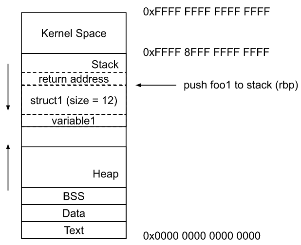
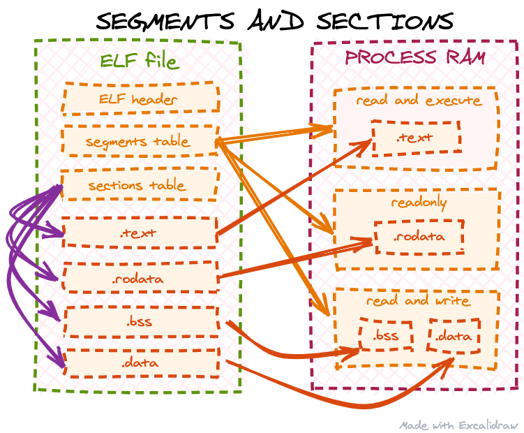

# EBPF samples

## linux/sample/bpf
Patch those [modification](https://patchwork.ozlabs.org/project/netdev/patch/20190518004639.20648-1-mcroce@redhat.com/) before build bpf sample.


## Standard API
See [Understanding the eBPF networking features in RHEL](https://access.redhat.com/documentation/en-us/red_hat_enterprise_linux/8/html/configuring_and_managing_networking/assembly_understanding-the-ebpf-features-in-rhel_configuring-and-managing-networking) for detail ebpf type introduce.

## eBPF hook module
Once eBPF program load to kernel success, user can attach to the corresponding module whenever. The module was specified by the section name of ebpf program.<br>
For example, `SEC("kprobe/ieee80211_key_alloc")` will be attached to kprobe module.<br>
eBPF support module hooking is as below : <br>
1. Dynamic Tracing (BPF_PROG_TYPE_KPROBE)
    1. Kernel Space
        1. [Kprobe](#kprobe_hook)
        2. [Kretprobe](#kretprobe_hook)
    2. User Space
        1. [Uprobe](#uprobe_hook)
        2. Uretprobe
2. Static Tracing (BPF_PROG_TYPE_TRACING)
    1. Kernel Space
        1. tracepointer
    2. User Space
        1. USDT
    3. General
        1. fentry
        2. fexit
3. Traffic Controller
    1. TC
    2. Classifier
    3. Action
4. Linux Security Module (BPF_PROG_TYPE_LSM)
   1. lsm
5. Express Data Path (BPF_PROG_TYPE_XDP)
6. Cgroup 


<h2 id=kprobe_hook> Kprobe </h2>

Developer can attach eBPF program wherever in kernel via `kprobe` module. But pleaseb remeber that `kprobe` is not the standard eBPF API, Iterations of kernel version may make `kprobe` type program meaningless.<br>
Traceable function persent at `/proc/kallsyms` :
```sh
➜  linux git:(master) ✗ vim ~/tmp/kallsyms
0000000000000000 A fixed_percpu_data
0000000000000000 A __per_cpu_start
0000000000000000 A cpu_debug_store
0000000000000000 A irq_stack_backing_store
0000000000000000 A cpu_tss_rw
0000000000000000 A gdt_page
0000000000000000 A exception_stacks
0000000000000000 A entry_stack_storage
0000000000000000 A espfix_waddr
0000000000000000 A espfix_stack
                ...
```
The `eBPF` program wii be triggered when attached function is called. developer can get input parameter via macro `PT_REGS_PARM${parameter_index}`.<br>
```c
tools/lib/bpf/bpf_tracing.h
#define PT_REGS_PARM1(x) (__PT_REGS_CAST(x)->__PT_PARM1_REG)
#define PT_REGS_PARM2(x) (__PT_REGS_CAST(x)->__PT_PARM2_REG)
#define PT_REGS_PARM3(x) (__PT_REGS_CAST(x)->__PT_PARM3_REG)
#define PT_REGS_PARM4(x) (__PT_REGS_CAST(x)->__PT_PARM4_REG)
#define PT_REGS_PARM5(x) (__PT_REGS_CAST(x)->__PT_PARM5_REG)
#define __PT_PARM1_REG rdi
#define __PT_PARM2_REG rsi
#define __PT_PARM3_REG rdx
#define __PT_PARM4_REG rcx
#define __PT_PARM5_REG r8
```
The `x86` arch register description is as below figure : <br>
<br>
Sample show how to peek Wi-Fi security key in userspace when success associated :<br>

Kernel Space :
```c
#include <linux/version.h>
#include <linux/bpf.h>
#include <bpf/bpf_helpers.h>
#include <bpf/bpf_tracing.h>
#include "trace_common.h"
typedef uint32_t u32;
typedef uint8_t u8;
#define _(P)                                                                   \
        ({                                                                     \
                typeof(P) val = 0;                                             \
                bpf_probe_read_kernel(&val, sizeof(val), &(P));                \
                val;                                                           \
        })
#define KEY2STR(x) _((x)[0]), _((x)[1])
#define MAX_ENTRIES 20
#define TK_LENGTH 16
struct ieee_80211_encrypt_key {
        u8 key_data[TK_LENGTH];
        size_t key_len;
};

struct {
        __uint(type, BPF_MAP_TYPE_HASH);
        __uint(key_size, sizeof(int));
        __uint(value_size, sizeof(struct ieee_80211_encrypt_key));
        __uint(max_entries, 10);
} key_map SEC(".maps");

void temporary_key_copy(u8 *src, int src_size, u8 *dst, int dst_size) {
        if (!src || !dst || src_size > dst_size)
                return;
#if 1
        for (int index = 0; index < dst_size; index++) {
                bpf_probe_read_kernel(&dst[index], sizeof(u8), &src[index]);
        }
        return;
#endif
}

/*** ieee80211_key_alloc
* @param1 chiper
* @param2 idx
* @param3 key_len
* @param4 key_data
* @param5 seq_len
* @param6 seq
* @param7 cs
* @Return : the pointer of ieee80211_key structure.
* */
SEC("kprobe/ieee80211_key_alloc")
int bpf_prog(struct pt_regs *ctx) {
        int key_index = (int)PT_REGS_PARM2(ctx);
        size_t key_len = (size_t)PT_REGS_PARM3(ctx);
        u8 *key_data = (u8 *)PT_REGS_PARM4(ctx);

        u64 *key_data_format = (u64 *)key_data;
        struct ieee_80211_encrypt_key key = {0};
        key.key_len = key_len;
        temporary_key_copy(key_data, key_len, key.key_data, TK_LENGTH);

        bpf_map_update_elem(&key_map, &key_index, &key, BPF_ANY);
        char fmt[] = "ieee80211_key_alloc: key index %ld\n\t%llx %llx";
        if (key_data)
                bpf_trace_printk(fmt, sizeof(fmt), key_index, KEY2STR(key_data_format));
        else
                bpf_trace_printk(fmt, sizeof(fmt), key_index, 0xff);
        return 0;
}

char _license[] SEC("license") = "GPL";
u32 _version SEC("version") = LINUX_VERSION_CODE;
```
User Space :
```c
#include <stdio.h>
#include <linux/bpf.h>
#include <bpf/libbpf.h>
#include <sys/syscall.h>

struct ieee_80211_encrypt_key {
        __u8 key_data[16];
        size_t key_len;
};

static void foreach_key_map(int map) {
        __u64 key, next_key;
        struct ieee_80211_encrypt_key encrypt;

        if (map < 0) return;
        key = -1;
        while (bpf_map_get_next_key(map, &key, &next_key) == 0) {
                bpf_map_lookup_elem(map, &next_key, &encrypt);
                key = next_key;
                printf("obj 0x%llx, key %lx %lx\n", next_key,
                                *(__u64 *)&(encrypt.key_data[0]), *(__u64 *)&(encrypt.key_data[8]));
        }
}

int main(int argc, char **argv) {
        struct bpf_object *obj;
        struct bpf_program *prog;
        char filename[256];
        struct bpf_link *link = NULL;

        snprintf(filename, sizeof(filename), "wifi_key_query_kern.o");

        obj = bpf_object__open_file(filename, NULL);
        if (libbpf_get_error(obj)) {
                fprintf(stderr, "ERROR : opening BPF object file failed\n");
                return 0;
        }
        prog = bpf_object__find_program_by_name(obj, "bpf_prog");
        if (!prog) {
                fprintf(stderr, "ERROR: ebpf program not found\n");
                goto cleanup;
        }

        if (bpf_object__load(obj)) {
                fprintf(stderr, "ERROR: loading BPF object file failed\n");
                goto cleanup;
        }
        link = bpf_program__attach(prog);
        if (libbpf_get_error(link)) {
                fprintf(stderr, "ERROR: bpf_program__attach failed\n");
                link = NULL;
                goto cleanup;
        }
        int map_fd = bpf_object__find_map_fd_by_name(obj, "key_map");
        if (map_fd <= 0) {
                fprintf(stderr, "map not found\n");
                goto cleanup;
        }
        while(1) {
                foreach_key_map(map_fd);
                sleep(1);
        }
cleanup:
        bpf_link__destroy(link);
        bpf_object__close(obj);
        return 0;
}
```

<br>

<h2 id=kretprobe_hook> Kretprobe </h2>

In `x86` architecture, the function return value will be restore in `EAX` register.<br>
For a sample increased fucntion like below : <br>
```c
int func1(int param) {
        return param + 1;
}
```
The assembly will be : <br>
We can notify the input value was increased and restore at `EAX` register.<br>
```sh
0000000000001129 <func1>:
    1129:       f3 0f 1e fa             endbr64
    112d:       55                      push   %rbp
    112e:       48 89 e5                mov    %rsp,%rbp
    1131:       89 7d fc                mov    %edi,-0x4(%rbp)
    1134:       8b 45 fc                mov    -0x4(%rbp),%eax
    1137:       83 c0 01                add    $0x1,%eax
    113a:       5d                      pop    %rbp
    113b:       c3                      retq
```
In `libbpf`, user can access return value via macro `PT_REGS_RC()` when target function was traped at `kretprobe`.<br>
```c
#define PT_REGS_RC(x) (__PT_REGS_CAST(x)->__PT_RC_REG
#define __PT_RC_REG eax
```

<h2 id=uprobe_hook> Uprobe </h2>

Uprobe is the userspace version of Kprobe, developer can hook ebpf program to application via uprobe.<br>
Similar with kprobe, uprobe provide function entry and function exist hook fucntion, `uprobe` and `uretprobe`.<br>
The input parameter printing please reference kprobe sample.<br>
Here we will discussion how to trace local variable and stack.<br>
### Local Variable Tracing
A userspace application `sample2` as below : <br>
```c
#include <stdio.h>
#include <stdint.h>

struct test_struct {
	uint8_t variable1;
	uint8_t variable2;
	uint32_t variable3;
	uint32_t variable4;
};

uint8_t foo1(uint8_t input) {
	uint8_t variable1 = 100;
	struct test_struct struct1;
	variable1 -= input;
	return (variable1 < 50 ? 1 : 0);
}

int main(int argc, char **argv) {
	printf("size of test_struct is %ld\n", sizeof(struct test_struct));
	printf("%d\n", foo1(8));
}
```
In this case, we want to trace the local variable `variable1` in function `foo1`.<br>
This variable is initially 100, then the input parameter `input` is subtracted. So we have to hook ebpf program to the third line of function `foo1`.<br>
We can find the offset via `objdump`.
```sh
➜  assembly_test objdump -S sample2
                ...
uint8_t foo1(uint8_t input) {
    1149:	f3 0f 1e fa          	endbr64 
    114d:	55                   	push   %rbp
    114e:	48 89 e5             	mov    %rsp,%rbp
    1151:	89 f8                	mov    %edi,%eax
    1153:	88 45 ec             	mov    %al,-0x14(%rbp)
	uint8_t variable1 = 100;
    1156:	c6 45 f3 64          	movb   $0x64,-0xd(%rbp)
	struct test_struct struct1;
	variable1 -= input;
    115a:	0f b6 45 ec          	movzbl -0x14(%rbp),%eax
    115e:	28 45 f3             	sub    %al,-0xd(%rbp)
	return (variable1 < 50 ? 1 : 0);
    1161:	80 7d f3 31          	cmpb   $0x31,-0xd(%rbp)
    1165:	0f 96 c0             	setbe  %al
}
    1168:	5d                   	pop    %rbp
    1169:	c3                   	retq   
                ...
```
The function entry is 0x1149 and subtract is 0x115e. because we want to observe the result of subtract, so the offset will be `0x1161` - `0x1149` = 24.<br>
The next step is finding virtual memory address of `variable1`.<br>
As the virtual memory layout of linux, local variable is stored at stack (start from the top of current stack).<br>
<br>

The address of top of current stack is stored at `rbp` register (x86 arch). so the address of `variable1` wii be : rbp - 0x0d (I actually not sure why variable1 is behind struct 1).<br>
Now we know the memory address of `variable1` and the location of `variable1` modification. the ebpf program will be :<br>
```c
#include <linux/version.h>
#include <linux/bpf.h>
#include <bpf/bpf_helpers.h>
#include <bpf/bpf_tracing.h>
#include "trace_common.h"
#define _(P)                                                                   \
	({                                                                     \
		typeof(P) val = 0;                                             \
		bpf_probe_read_user(&val, sizeof(val), &(P));                  \
		val;                                                           \
	})

SEC("uprobe//home/markshu/any_test/assembly_test/sample2:foo1+24")
int bpf_prog2(struct pt_regs *ctx) {
	long bp = (long)PT_REGS_RET(ctx);
	uint8_t return_value = PT_REGS_RC(ctx);
	//uint8_t return_value = PT_REGS_SP(ctx);
	uint8_t *variable_ptr = (uint8_t *)(bp - 0xd);
	char fmt[] = "hello foo1+24, %lx, %d\n";
	bpf_trace_printk(fmt, sizeof(fmt), bp, _(*variable_ptr));
	return 0;
}
char _license[] SEC("license") = "GPL";
u32 _version SEC("version") = LINUX_VERSION_CODE;
```
The execution will be:<br>
```sh
➜  bpf git:(master) ✗ sudo ./ebpf_sample2
         sample2-619114  [002] d...1 518475.304742: bpf_trace_printk: hello foo1+24, 7ffd03a949d0, 92
```
### Caller Stack Tracing
To tracing the caller stack, that's some knowledge required.<br>
1. Return Address<br>
<br>
When the callee push to stack, the address of next instruction of caller will be stored 8 byte above from stack base pointer(RBP).<br>
After the callee finished, CPU pop the callee stack and go back to the record address to execute instruction continually.<br>
To tracing the complete caller chain, we can extract all return address in stack and find those instruction belong to which functions.<br>
We can also get those address by eBPF helper [bpf_get_stack](https://man7.org/linux/man-pages/man7/bpf-helpers.7.html).
For more information, please refer [你所不知道的 C 語言: 函式呼叫篇](https://hackmd.io/@dange/rk9xmgHKX?type=view).<br>
2. Text Segment
The soruce code was stored at text segment. the syscall `exec()` copies text section of ELF file to text segement in virtual memory.<br>
<br>

3. Base Address
[Supporting Relocation](https://www.gnu.org/software/gnulib/manual/html_node/Supporting-Relocation.html).<br>

eBPF program is as below :
```c
#include <linux/version.h>
#include <linux/bpf.h>
#include <bpf/bpf_helpers.h>
#include <bpf/bpf_tracing.h>
#include "trace_common.h"
#define _(P)                                                                   \
        ({                                                                     \
                typeof(P) val = 0;                                             \
                bpf_probe_read_user(&val, sizeof(val), &(P));                  \
                val;                                                           \
        })

SEC("uprobe//home/markshu/any_test/assembly_test/sample2:foo1+24")
int bpf_prog2(struct pt_regs *ctx) {
	uint32_t pid = bpf_get_current_pid_tgid() >> 32;
	pid_t ppid;
	struct task_struct *current_t = bpf_get_current_task();
	if (!current_t) return -1;
//	bpf_core_read(&ppid, sizeof(pid_t), &current_t->pid);
	ppid = BPF_CORE_READ(current_t, pid);
	long bp = (long)PT_REGS_FP(ctx);
	long *rsp = (long *)(bp + 0x8);
	uint8_t *variable_ptr = (uint8_t *)(bp - 0xd);

	char fmt[] = "current PID %ld, Host PID %ld, Return Address %lx\n";
	bpf_trace_printk(fmt, sizeof(fmt), pid, ppid, _(*rsp));
	return 0;
}


char _license[] SEC("license") = "GPL";
u32 _version SEC("version") = LINUX_VERSION_CODE;
```
When the demo app execute, we can get the return address of function `foo1` is `0x55b89d2f81bd`.<br>
```sh
➜  bpf git:(master) ✗ sudo ./memory_leak_detect
          sample2-134580  [006] d...1 85526.540676: bpf_trace_printk: current PID 134580, Host PID 134580, Return Address 557dbd7de1bd
```
Return Address must point to an instruction which stored in `Text` segment. We can check it's legality via `/proc/${PID}/maps`.<br>
```sh
➜  ~ cat /proc/1585626/maps
55b89d2f7000-55b89d2f8000 r--p 00000000 103:05 7340453                   /home/markshu/any_test/assembly_test/sample2
55b89d2f8000-55b89d2f9000 r-xp 00001000 103:05 7340453                   /home/markshu/any_test/assembly_test/sample2
55b89d2f9000-55b89d2fa000 r--p 00002000 103:05 7340453                   /home/markshu/any_test/assembly_test/sample2
55b89d2fa000-55b89d2fb000 r--p 00002000 103:05 7340453                   /home/markshu/any_test/assembly_test/sample2
55b89d2fb000-55b89d2fc000 rw-p 00003000 103:05 7340453                   /home/markshu/any_test/assembly_test/sample2
55b89e415000-55b89e436000 rw-p 00000000 00:00 0                          [heap]
                        ...
7ffd03a89000-7ffd03aaa000 rw-p 00000000 00:00 0                          [stack]
7ffd03b98000-7ffd03b9c000 r--p 00000000 00:00 0                          [vvar]
7ffd03b9c000-7ffd03b9e000 r-xp 00000000 00:00 0                          [vdso]
7fffffffe000-7ffffffff000 --xp 00000000 00:00 0                          [uprobes]
ffffffffff600000-ffffffffff601000 --xp 00000000 00:00 0                  [vsyscall]
```
The `Text` segment usually have `executable (x)` permission, it's easy to find. In this case is `0x55b89d2f8000 - 0x55b89d2f9000`.<br>
The offset of instruction is 0x55b89d2f81bd - 0x55b89d2f8000 = 0x1bd, and we also know the `Text` segment is copied from `Text` section of executable file.<br>
Finally, we can locate the instruction via `objdump`.<br>
```sh
➜  assembly_test objdump -d sample2
Disassembly of section .init:
0000000000001000 <_init>:
    1000:       f3 0f 1e fa             endbr64
    1004:       48 83 ec 08             sub    $0x8,%rsp
    1008:       48 8b 05 d9 2f 00 00    mov    0x2fd9(%rip),%rax        # 3fe8 <__gmon_start__>
    100f:       48 85 c0                test   %rax,%rax
    1012:       74 02                   je     1016 <_init+0x16>
    1014:       ff d0                   callq  *%rax
    1016:       48 83 c4 08             add    $0x8,%rsp
    101a:       c3                      retq
                        ...
000000000000118a <main>:
                        ...
    11b3:       bf 08 00 00 00          mov    $0x8,%edi
    11b8:       e8 ac ff ff ff          callq  1169 <foo1>
    11bd:       bf 01 00 00 00          mov    $0x1,%edi
    11c2:       b8 00 00 00 00          mov    $0x0,%eax
    11c7:       e8 a4 fe ff ff          callq  1070 <sleep@plt>
    11cc:       eb ef                   jmp    11bd <main+0x33>
    11ce:       66 90                   xchg   %ax,%ax

00000000000011d0 <__libc_csu_init>:
                        ...
```
As the result of objdump, the address offset of `main` fucntion is from `0x18a` to `0x1d0` which is contain `0x1bd`, so the caller of `foo1()` is `main()`.<br>

### Patch
Patch below patch before compile `libbpf`. This patch reference [[PATCH v3 bpf-next 1/4] libbpf: support function name-based attach uprobes](https://lore.kernel.org/bpf/1643645554-28723-2-git-send-email-alan.maguire@oracle.com/)<br>
<details><summary>0001-dynamic-symbol-resolute-support.patch</summary>
<p>

```patch
diff --git a/tools/lib/bpf/libbpf.c b/tools/lib/bpf/libbpf.c
index e89cc9c885b3..7186c03a9bd4 100644
--- a/tools/lib/bpf/libbpf.c
+++ b/tools/lib/bpf/libbpf.c
@@ -11024,8 +11024,9 @@ static long elf_find_relative_offset(const char *filename, Elf *elf, long addr)
        pr_warn("elf: failed to find prog header containing 0x%lx in '%s'\n", addr, filename);
        return -ENOENT;
 }
-
-/* Return next ELF section of sh_type after scn, or first of that type if scn is NULL. */
+/* Return next ELF section of sh_type after scn, or first of that type
+ * if scn is NULL.
+ */
 static Elf_Scn *elf_find_next_scn_by_type(Elf *elf, int sh_type, Elf_Scn *scn)
 {
        while ((scn = elf_nextscn(elf, scn)) != NULL) {
@@ -11034,9 +11035,47 @@ static Elf_Scn *elf_find_next_scn_by_type(Elf *elf, int sh_type, Elf_Scn *scn)
                if (!gelf_getshdr(scn, &sh))
                        continue;
                if (sh.sh_type == sh_type)
-                       return scn;
+                       break;
        }
-       return NULL;
+       return scn;
+}
+/* For Position-Independent Code-based libraries, a table of trampolines
++ * (Procedure Linking Table) is used to support resolution of symbol
++ * names at linking time.  The goal here is to find the offset associated
++ * with the jump to the actual library function.  If we can instrument that
++ * locally in the specific binary (rather than instrumenting glibc say),
++ * overheads are greatly reduced.
++ *
++ * The method used is to find the .plt section and determine the offset
++ * of the relevant entry (given by the base address plus the index
++ * of the function multiplied by the size of a .plt entry).
++ */
+static ssize_t elf_find_plt_offset(Elf *elf, size_t ndx)
+{
+       Elf_Scn *scn = NULL;
+       size_t shstrndx;
+
+       if (elf_getshdrstrndx(elf, &shstrndx)) {
+               pr_debug("elf: failed to get section names section index: %s\n",
+                        elf_errmsg(-1));
+               return -LIBBPF_ERRNO__FORMAT;
+       }
+       while ((scn = elf_find_next_scn_by_type(elf, SHT_PROGBITS, scn))) {
+               long plt_entry_sz, plt_base;
+               const char *name;
+               GElf_Shdr sh;
+
+               if (!gelf_getshdr(scn, &sh))
+                       continue;
+               name = elf_strptr(elf, shstrndx, sh.sh_name);
+               if (!name || strcmp(name, ".plt") != 0)
+                       continue;
+               plt_base = sh.sh_addr;
+               plt_entry_sz = sh.sh_entsize;
+               return plt_base + (ndx * plt_entry_sz);
+       }
+       pr_debug("elf: no .plt section found\n");
+       return -LIBBPF_ERRNO__FORMAT;
 }

 /* Find offset of function name in object specified by path.  "name" matches
@@ -11048,7 +11087,7 @@ static long elf_find_func_offset(const char *binary_path, const char *name)
        bool is_shared_lib, is_name_qualified;
        char errmsg[STRERR_BUFSIZE];
        long ret = -ENOENT;
-       size_t name_len;
+       size_t name_len, sym_ndx = -1;
        GElf_Ehdr ehdr;
        Elf *elf;

@@ -11130,10 +11169,10 @@ static long elf_find_func_offset(const char *binary_path, const char *name)
                        /* ...but we don't want a search for "foo" to match 'foo2" also, so any
                         * additional characters in sname should be of the form "@@LIB".
                         */
-                       if (!is_name_qualified && sname[name_len] != '\0' && sname[name_len] != '@')
+                       if (!is_name_qualified && strlen(sname) > name_len && sname[name_len] != '@')
                                continue;

-                       if (ret >= 0) {
+                       if (ret >= 0 && last_bind != -1) {
                                /* handle multiple matches */
                                if (last_bind != STB_WEAK && curr_bind != STB_WEAK) {
                                        /* Only accept one non-weak bind. */
@@ -11150,8 +11189,11 @@ static long elf_find_func_offset(const char *binary_path, const char *name)
                        }
                        ret = sym.st_value;
                        last_bind = curr_bind;
+                       sym_ndx = idx;
                }
                /* For binaries that are not shared libraries, we need relative offset */
+               if (ret == 0 && sh_types[i] == SHT_DYNSYM)
+                       ret = elf_find_plt_offset(elf, sym_ndx);
                if (ret > 0 && !is_shared_lib)
                        ret = elf_find_relative_offset(binary_path, elf, ret);
                if (ret > 0)
```
</p></details>
