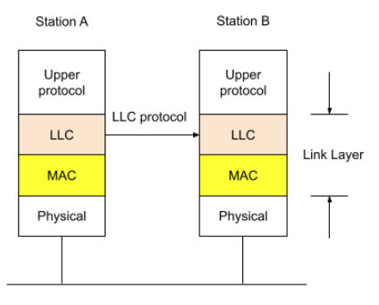
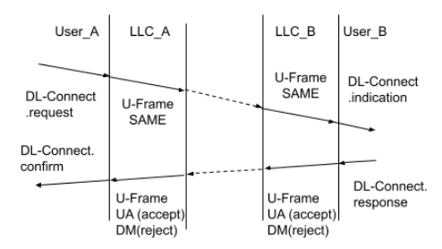
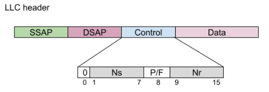

# Logical Link Control
Logical Link Control(LLC) is a sub-layer of Layer2.  
  
LLC header
<table>
    <tr>
        <td>DSAP</td>
        <td>SSAP</td>
        <td align="center">Control Field</td>
        <td colspan="3" align="center"> Organization Code</td>
        <td colspan="2" align="center">Type</td>
    </tr>
    <tr>
        <td align="center">0xaa</td>
        <td align="center">0xaa</td>
        <td align="center">0x03</td>
        <td align="center">0x00</td>
        <td align="center">0x00</td>
        <td align="center">0x00</td>
        <td align="center">0x80</td>
        <td align="center">0x00</td>
    </tr>
</table>

LLC sub-layer provide several service.  
* [Provide a abstract layer (SAP) to upper protocol to access network.](#sap)  
* [Data flow control.](#llc_protocol)  

## LLC service initialize process
```c
static struct packet_type llc_packet_type __read_mostly = {
    .type = cpu_to_be16(ETH_P_802_2),
    .func = llc_rcv,
};
static struct packet_type llc_tr_packet_type __read_mostly = {
    .type = cpu_to_be16(ETH_P_TR_802_2),
    .func = llc_rcv,
}

static int __init llc_init(void) {
    dev_add_pack(&llc_packet_type);
    dev_add_pack(&llc_tr_packet_type);
}
module_init(llc_init);
```
<details><summary>dev_add_pack()</summary>
<p>

```c
net/core/dev.c
void dev_add_pack(struct packet_type *pt) {
    struct list_head *head = ptype_head(pt);
    spin_lock(&ptype_lock);
    list_add_rcu(&pt->list, head);
    spin_unlock(&ptype_lock);
}

struct list_head ptype_base[PTYPE_HASH_SIZE] __read_mostly;

static inline struct list_head *ptype_head(const struct packet_type *pt) {
    if (pt->type == htons(ETH_P_ALL))
        return pt->dev ? &pt->dev->ptype_all : &ptype_all;
    else
        return pt->dev ? &pt->dev->ptype_specific : & ptype_base[ntohs(pt->type) & PTYPE_HASH_MASK];
}
```
</p></details>

After calling `dev_add_pack()`, LLC module register the packet (Ethtype == ETH_P_802_2) handler to MAC layer.  
The complete packet handle process (For example MAC80211):  
`ieee80211_rx_h_data()` -> `ieee80211_deliver_skb()` -> `netif_receive_skb()` ->  
	`netif_receive_skb_internal()` -> `__netif_receive_skb()` -> `__netif_receive_skb_core()`  
<details><summary>__netif_receive_skb_core()</summary>
<p>

```c
net/core/dev.c
static int __netif_receive_skb_core(struct sk_buff **pskb, bool pfmemalloc, struct packet_type **ppt_prev) {
		.
		.
		.
	type = skb->protocol;
	if (likely(!deliver_exact)) {
		deliver_ptype_list_skb(skb, &pt_prev, orig_dev, type, &ptype_base[ntohs(type) & PTYPE_HASH_MASK])
	}
}
	
static inline void deliver_ptype_list_skb(struct sk_buff *skb, struct packet_type **pt,
	struct net_device *orig_dev, _be16 type, struct list_head *ptype_list) {
	list_for_each_entry_rcu(ptype, ptype_list, list) {
		if (ptype->ptype != type)
			continue;
		if (pt_prev)
			deliver_skb(skb, pt_prev, orig_dev);
		pt_prev = ptype;
    }
    *pt = pt_prev;	
}

static inline int deliver_skb(struct sk_buff *skb, struct packet_type *pt_prev, struct net_device *orig_dev) {
	if (unlikely(skb_orphan_frags(skb, GFP_ATOMIC)))
		return -ENOMEM;
	atomic_inc(&skb->users);
	return pt_prev->func(skb, skb->dev, pt_prev, orig_dev);
}
```
</p></details>

<h2 id="sap">Station Access Pointer (SAP)</h2>
Consider of network scalability, LLC provide Service Access Pointer(SAP) to upper protocol.  
LLC will notify the registered service when receive the message from the corresponding SAP.  

<details><summary>llc_sap_open()</summary>
<p>

```c
struct llc_sap *llc_sap_open(unsigned char lsap, int (*func)(struct sk_buff *skb, 
	struct net_device *dev, struct packet_type *pt, struct net_device *orig_dev)) {
	struct llc_sap *sap = NULL;

	spin_lock_bh(&llc_sap_list_lock);
	if (__llc_sap_find(lsap))
		goto out;
	sap = llc_sap_alloc();
	if (!sap)
		goto out;
	sap->laddr.lsap = lsap;
	sap->rcv_func = func;
	//llc_sap_list is static link list at llc module to storage SAP member.
	list_add_tail_rcu(&sap->node, &llc_sap_list);
out:
	spin_unlock_bh(&llc_sap_list_lock);
	return sap;
}
```
</p></details>

### Registered SAP
At linux-5.4.105, Several service register SAP service.
<details><summary>Subnetwork Access Protocol (SNAP)</summary>
<p>

```c
static int __init snap_init(void) {
	snap_sap = llc_sap_open(0xAA, snap_rcv);
	if (!snap_sap) {
		printk(snap_err_msg);
		return -EBUSY;
	}
	return 0;
}
```
</p></details>
<details><summary>Spanning Tree Protocol (STP)</summary>
<p>

```c
int stp_proto_register(const struct stp_proto *proto) {
	int err = 0;
	
	mutex_lock(&stp_proto_mutex);
	if (sap_registered++ == 0) {
		sap = llc_sap_open(LLC_SAP_BSPAN, stp_pdu_rcv); // #define LLC_SAP_BSPAN 0x42
		if (!sap) {
			err = -ENOMEM;
			goto out;
		}
	}
	if (is_zero_ether_addr(proto->group_address))
		rcu_assign_pointer(stp_proto, proto);
	else
		rcu_assign_pointer(garp_protos[proto->group_address[5] -
			GARP_ADDR_MIN], proto);
out:
	mutex_unlock(&stp_proto_mutex);
	return err;
}
```
</p></details>

<h3 id="deliver_packet_to_sap"> Deliver Packet to SAP </h3>

The callback function `llc_rcv()` will find the corresponding SAP by the DSAP specific in llC header,  
then calling the private receive function which register by calling `llc_sap_open()`.  
<details><summary>llc_rcv()</summary>
The callback function which register when module initialize function.
<p>

```c
int llc_rcv(struct sk_buff *skb, struct net_device *dev, struct packet_type *pt, struct net_device *orig_dev) {
		.
		.
		.
	struct llc_sap *sap;
	struct llc_pdu_sn *pdu;
	int dest;
	int (*rcv)(struct sk_buff *, struct net_device *, struct packet_type *, struct net_device *);
		.
		.
		.
	pdu = llc_pdu_sn_hdr(skb); // extract llc header from sk_buff
	if (unlikely(!pdu->dsap))
		goto headle_station;
	sap = llc_sap_find(pdu->dsap);
	if (unlikely(pdu->dsap)) {
		dprintk("%s: llc_sap_find(%02x) failed\n", __func__, pdu->dsap);
		goto drop;
	}
	rcv = rcu_derefence(sap->rcv_func);
	/***
	 * Now we know how LLC derive packet to corresponding SAP by extract the SAP value from LLC header.
	 */
	dest = llc_pdu_type(skb);
	sap_handler = dest ? READ_ONCE(llc_type_handlers[dest - 1]) : NULL;
	if(unlikely(!sap_handler)) {
		if (rcv)
			rcv(skb, dev, pt, orig_dev);
		else
			kfree_skb(skb);
	} else {
		if (rcv) {
			struct sk_buff *cskb = skb_clone(skb, GFP_ATOMIC);
			if (cskb)
				rcv(cskb, dev, pt, orig_dev);
		}
		sap_handler(sap, skb);
	}
	llc_sap_put(sap);
		.
		.
		.
}

struct llc_sap *llc_sap_find(unsigned char sap_value) {
	struct llc_sap *sap;

	rcu_read_lock_bh();
	sap = __llc_sap_find(sap_value);
	if (!sap || !llc_sap_hold_safe(sap))
		sap = NULL;
	rcu_read_unlock_bh();
	return sap;
}

static struct llc_sap *__llc_sap_find(unsigned char sap_value) {
	struct llc_sap *sap;

	list_for_each_entry(sap, &llc_sap_list, node)
		if (sap->laddr.lsap == sap_value)
			goto out;
	sap = NULL;
out:
	return sap;
}

```
</p></details>

<h2 id="llc_protocol"> LLC Protocol</h2>

In section [Deliver Packet to SAP](#deliver_packet_to_sap), we know LLC handle received packet by function `llc_rcv()`.  
```c
int llc_rcv(struct sk_buff *skb, struct net_device *dev,
	struct packet_type *pt, struct net_device *orig_dev) {
		.
		.
		.
	sap = llc_sap_find(pdu->dsap);
	if (unlikely(pdu->dsap)) {
		dprintk("%s: llc_sap_find(%02x) failed\n", __func__, pdu->dsap);
		goto drop;
	}
	rcv = rcu_derefence(sap->rcv_func);
	dest = llc_pdu_type(skb);
	sap_handler = dest ? READ_ONCE(llc_type_handlers[dest - 1]) : NULL;
	if(unlikely(!sap_handler)) {
		if (rcv)
			rcv(skb, dev, pt, orig_dev);
		else
			kfree_skb(skb);
	} else {
		if (rcv) {
			struct sk_buff *cskb = skb_clone(skb, GFP_ATOMIC);
			if (cskb)
				rcv(cskb, dev, pt, orig_dev);
		}
		sap_handler(sap, skb);
	}
}
```
The pointer `rcv` sure point to the private callback function which assigned by the other module owner.   
But what's the oject `llc_type_handlers` ?  
Let's see another module `LLC2`.
```c
static int __init llc2_init(void) {
	int rc = proto_register(&llc_proto, 0);
		.
		.
		.
	rc = sock_register(&llc_ui_family_ops);
	if (rc) {
		printk(llc_sock_err_msg);
		goto out_sysctl;
	}
	llc_add_pack(LLC_DEST_SAP, llc_sap_handler);
	llc_add_pack(LLC_DEST_CONN, llc_conn_handler);
		.
		.
		.
}

void llc_add_pack(int type, void (*handler)(struct llc_sap *sap, struct sk_buff *skb)) {
	smp_wmb();
	if (type == LLC_DEST_SAP || type == LLC_DEST_CONN)
		llc_type_handlers[type - 1] = handler;
}
```
According to the Kconfig of LLC module.
```sh
# SPDX-License-Identifier: GPL-2.0-only
config LLC
    tristate
    depends on NET

config LLC2
    tristate "ANSI/IEEE 802.2 LLC type 2 Support"
    select LLC
    help
       This is a Logical Link Layer type 2, connection oriented support.
        Select this if you want to have support for PF_LLC sockets.
```

LLC provide two service to translate data.
* [Type 1 service (Connectionless service)](#llc_type_1_service)
* [Type 2 service (Connection-Oriented service)](#llc_type_2_service)

<h3 id="llc_type_1_service">Type 1 Service (Connectionless service)</h3>

The connectionless service provide only `request` and `indication` interface.  
Naming connectionless because without connection handshake.  

LLC used type `LLC_DEST_SAP` to mark the type 1 service.  
According to the `llc2_init()`, the corresponding handler is `llc_sap_handler()`.  
<details><summary>llc_sap_handler()</summary>
<p>

```c
void llc_sap_handler(struct *llc_sap *sap, struct sk_buff *skb) {
	struct llc_addr laddr;

	llc_pdu_decode_da(skb, laddr.mac);
	llc_pdu_decode_dsap(skb, &laddr.lsap);

	if (is_multicast_ether_addr(laddr.mac)) {
		llc_sap_mcast(sap, &laddr, skb);
		kfree_skb(skb);
	} else {
		struct sock *sk = llc_lookup_dgram(sap, &laddr);
		if (sk) {
			llc_sap_rcv(sap, skb, sk);
			sock_put(sk);
		} else
			 kfree_skb(skb)l
	}
}

static struct sock *llc_lookup_dgram(struct llc_sap *sap,
	const struct llc_addr *laddr) {
	struct sock *rc;
	struct hlist_nulls_node *node;
	int slot = llc_sk_laddr_hashfn(sap, laddr);
	struct hlist_nulls_head *laddr_hb = &sap->sk_laddr_hash[slot];

	rcu_read_lock_bh();
again:
	sk_nulls_for_each_rcu(rc, node, laddr_hb) {
		if (llc_dgram_match(sap, laddr, rc)) {
			/* Extra checks required by SLAB_TYPESAFE_BY_RCU */
			if (unlikely(!refcount_inc_not_zero(&rc->sk_refcnt)))
				goto again;
			if (unlikely(llc_sk(rc)->sap != sap ||
				!llc_dgram_match(sap, laddr, rc))) {
				sock_put(rc);
				continue;
			}
			goto found;
		}
	}
	rc = NULL;
	/*
	 * if the nulls value we got at the end of this lookup is
	 * not the expected one, we must restart lookup.
	 * We probably met an item that was moved to another chain.
	 */
if (unlikely(get_nulls_value(node) != slot))
	goto again;
found:
	rcu_read_unlock_bh();
	return rc;
}
```
</p></details>

Function `llc_look_dgram()` is used to search matched `sock` structure from the hash table `sk_laddr_hash` in the `llc_sap` structure.  
The structure `sock` will be added by function `llc_sap_add_socket()`.  
<details><summary>llc_sap_add_socket()</summary>
<p>

```c
void llc_sap_add_socket(struct llc_sap *sap, struct sock *sk)
{
	struct llc_sock *llc = llc_sk(sk);
	struct hlist_head *dev_hb = llc_sk_dev_hash(sap, llc->dev->ifindex);
	struct hlist_nulls_head *laddr_hb = llc_sk_laddr_hash(sap, &llc->laddr);

	llc_sap_hold(sap);
	llc_sk(sk)->sap = sap;

	spin_lock_bh(&sap->sk_lock);
	sock_set_flag(sk, SOCK_RCU_FREE);
	sap->sk_count++;
	sk_nulls_add_node_rcu(sk, laddr_hb);
	hlist_add_head(&llc->dev_hash_node, dev_hb);
	spin_unlock_bh(&sap->sk_lock);
}
```
</p></details>

Let's back to `llc_sap_handler()`, if the matched `sock` structure is found, calling `llc_sap_rcv()` to process packet.  
<details><summary>llc_sap_rcv()</summary>
<p>

```c
static void llc_sap_rcv(struct llc_sap *sap, struct sk_buff *skb, strcut sock *sk) {
	struct llc_sap_state_ev *ev = llc_sap_ev(skb);

	ev->type = LLC_SAP_EV_TYPE_PDU;
	ev->reason = 0;
	skb_orphan(skb);
	sock_hold(sk);
	skb->sk = sk;
	skb->destructor = sock_efree;
	llc_sap_state_process(sap, skb);
}

static void llc_sap_state_process(struct llc_sap *sap, struct sk_buff *skb) {
	struct llc_sap_state_ev *ev = llc_sap_ev(skb);

	ev->ind_cfm_flag = 0;
	llc_sap_next_state(sap, skb);

	if (ev->ind_cfm_flag == LLC_IND && skb->sk->sk_state != TCP_LISTEN) {
		llc_save_primitive(skb->sk, skb, ev->prim);
		
		/* queue skb to the user */
		if (sock_queue_rcv_skb(skb->sk, skb) == 0)
			return;
	}
	kfree_skb(skb);
}
```
</p></details>

At type 1 service, LLC support three command
* [Unnumbered information (UI)](#ui_cmd)
* [XID](#xid_cmd)
* [TEST](#test_cmd)

LLC used function `llc_sap_next_state()` to determine type of command.  
<details><summary>llc_sap_next_state()</summary>
<p>

```c
static int llc_sap_next_state(struct llc_sap *sap, struct sk_buff *skb) {
	int rc = 1;
	struct llc_sap_state_trans *trans;

	if (sap->state > LLC_NR_SAP_STATES)
		goto out;
	trans = llc_find_sap_trans(sap, skb);
	if (!trans)
		goto out;
	rc = llc_exec_sap_trans_actions(sap, trans, skb);
	if (rc)
		goto out;
	sap->state = trans->next_state;
out:
    return rc;
}

static struct llc_sap_state_trans *llc_find_sap_trans(struct llc_sap *sap, struct sk_buff *skb) {
	int i = 0;
	struct llc_sap_state_trans *rc =NULL;
	struct llc_sap_state_trans **next_trans;
	struct llc_sap_state *curr_state = &llc_sap_state_table[sap->state - 1];

	for (next_trans = curr_state->transitions; next_trans[i]->ev; i++)
		if (!next_trans[i]->ev(sap, skb)) {
			rc = next_trans[i];
			break;
		}
	return rc;
}

static struct llc_sap_state_trans *llc_sap_active_state_transitions[] = {
	[0] = &llc_sap_active_state_trans_2,
	[1] = &llc_sap_active_state_trans_1, /* UI command received */
	[2] = &llc_sap_active_state_trans_3, /* XID command sending */
	[3] = &llc_sap_active_state_trans_4, /* XID command received */
	[4] = &llc_sap_active_state_trans_5, /* XID response received */
	[5] = &llc_sap_active_state_trans_6, /*TEST command sending*/
	[6] = &llc_sap_active_state_trans_7, /* TEST command received */
	[7] = &llc_sap_active_state_trans_8, /* TEST response received */
	[8] = &llc_sap_active_state_trans_9, /* transit sap status to inactive from active. */
	[9] = &llc_sap_state_trans_end,
};

static int llc_exec_sap_trans_actions(struct llc_sap *sap,
	struct llc_sap_state_trans *trans, struct sk_buff *skb) {
	int rc = 0;
	const llc_sap_action_t *next_action = trans->ev_actions;

	for (; next_action && *next_action; next_action++)
		if ((*next_action)(sap, skb))
			rc = 1;
	return rc;
}
```
</p></details>

<h4 id="ui_cmd"> Unnumbered Information</h4>

LLC sender use UI command to send data, the DSAP can be personal, group or broadcast address.  
UI command without senquence, each command is individual.  

```c
static struct llc_sap_state_trans llc_sap_active_state_trans_1 = {
	.ev			= llc_sap_ex_ui,
	.next_state = LLC_SAP_STATE_ACTIVE,
	.ev_actions = llc_sap_active_state_actions_1,
}

static const llc_sap_action_t llc_sap_active_state_actions_1[] = {
	[0] = llc_sap_action_unitdata_ind.
	[1] = NULL,
};

int llc_sap_action_unitdata_ind(struct llc_sap *sap, struct sk_buff *skb) {
	llc_sap_rtn_pdu(sap, skb);
	return 0;
}

void llc_sap_rtn_pdu(struct llc_sap *sap, struct sk_buff *skb) {
	struct llc_sap_state_ev *ev = llc_sap_ev(skb);
	struct llc_pdu_un *pdu = llc_pdu_un_hdr(skb);

	switch(LLC_UP_PDU_RSP(pdu)) {
	case LLC_1_PDU_CMD_TEST:
		ev->prim = LLC_TEST_PRIM; break;
	case LLC_1_PDU_CMD_XID:
		ev->prim = LLC_XID_PRIM; break;
	case LLC_1_PDU_CMD_UI:
		ev->prim = LLC_DATAUNIT_PRIM; break;
	}
	/* flag which use to mark this packet should notify user-space daemon.
	 * use llc_sap_state_process() for more information.
	 */
	// flag which use to mark this packet should notify usr-space daemon.
	ev->ind_cfm_flag = LLC_IND;
}
```

<h4 id="xid_cmd">XID</h4>

LLC sender ask LLC group or personal address by sending `XID` command at type 1 service.  
Receiver response personal address by `XID` command also.  

<details><summary>Sending XID command</summary>
<p>

```c
/* llc_sap_active_state_trans_3 used when kernel try to send XID command packet */
static struct llc_sap_state_trans llc_sap_active_state_trans_3 = {
	.ev			= llc_sap_ev_xid_req,
	.next_state = LLC_SAP_STATE_ACTIVE,
	.ev_actions = llc_sap_active_state_action_3,
};
static const llc_sap_action_t llc_sap_active_state_actions_3[] = {
	[0] = llc_sap_actcion_send_xid_c,
	[1] = NULL,
};

int llc_sap_action_send_xid_c(struct llc_sap *sap, struct sk_buff *skb) {
	struct llc_sap_state_ev *ev = llc_sap_ev(skb);
	int rc;

	llc_pdu_header_init(skb, LLC_PDU_TYPE_U, ev->saddr.lsap, ev->daddr.lsap, LLC_PDU_CMD);
	llc_pdu_init_as_xid_cmd(skb, LLC_XID_NULL_CLASS_2, 0);
	rc = llc_mac_hdr_init(skb, ev->saddr.mac, ev->daddr.mac);
	if(likely(!rc)) {
		skb_get(skb);
		rc = dev_queue_xmit(skb);
	}
	return rc;
}
```
</p></details>

<details><summary>Received XID command</summary>
<p>

```c
/* llc_sap_active_state_trans_4 used when kernel received XID command packet */
static struct llc_sap_state_trans llc_sap_active_state_trans_4 = {
	.ev			= llc_sap_ev_xid_c,
	.next_state = LLC_SAP_STATE_ACTIVE,
	.ev_actions = llc_sap_active_state_action_4,
};
static const llc_sap_action_t llc_sap_active_state_action_4[] = {
	[0] = llc_sap_action_send_xid_r,
	[1] = NULL;
};

int llc_sap_action_send_xid_r(struct llc_sap *sap, struct sk_buff *skb) {
	u8 mac_da[ETH_ALEN], mac_sa[ETH_ALEN], dsap;
	int rc = 1;
	struct sk_buff *nskb;

	llc_pdu_decode_sa(skb, mac_da);
	llc_pdu_decode_da(skb, mac_da);
	llc_pdu_decode_ssap(skb, mac_da);
	nskb = llc_alloc_frame(NULL, skb->dev, LLC_PDU_TYPE_U, sizeof(struct llc_xid_info));
	if (!nskb)
		goto out;
	llc_pdu_header_init(nskb, LLC_PDU_TYPE_U, sap->laddr.lsap, dsap, LLC_PDU_RSP);
	llc_pdu_init_as_xid_rsp(nskb, LLC_XID_NULL_CLASS_2, 0);
	rc = llc_mac_hdr_init(nskb, mac_sa, mac_da);
	if (likely(!rc))
		rc = dev_queue_xmit(nskb);
out:
	return rc;
}
```
</p></details>

<details><summary>Received XID response</summary>
<p>

```c
/* llc_sap_active_state_trans_5 used when kernel received  XID response packet */
static struct llc_sap_state_trans llc_sap_active_state_trans_5 = {
	.ev			= llc_sap_ev_xid_r,
	.next_state = LLC_SAP_STATE_ACTIVE,
	.ev_actions = llc_sap_active_state_action_5,
};

static struct llc_sap_state_trans llc_sap_active_state_trans_5 = {
	[0] = llc_sap_action_xid_ind,
	[1] = NULL,
};

int llc_sap_action_xid_ind(struct llc_sap *sap, struct sk_buff *skb) {
	llc_sap_rtn_pdu(sap, skb);
	return 0;
}
```
</p></details>

<h4 id="test_cmd">TEST</h4>

Sender use `TEST` command to check the link status. Receiver response by `TEST` command also.  
TEST format packet process is similar with `XID` format packet.  

<h3 id="llc_type_2_service">Type 2 Service (Connection-Oriented Service)</h3>

The connection-oriented service provide handshake process to establish link,  
and acknowledge mechanism to check the data was sending success.  

LLC used type `LLC_DEST_CONN` to mark the type 2 service.  
According to the llc2_init(), the corresponding handler is llc_conn_handler().  
<details><summary>llc_conn_handler()</summary>
<p>

```c
void llc_conn_handler(struct llc_sap *sap, struct sk_buff *skb) {
	struct llc_addr saddr, daddr;
	struct sock *sk;

	llc_pdu_decode_sa(skb, saddr.mac);
	llc_pdu_decode_ssap(skb, &saddr.lsap);
	llc_pdu_decode_da(skb, daddr.mac);
	llc_pdu_decode_dsap(skb, &daddr.lsap);

	sk = __llc_lookup(sap, &saddr, &daddr);
	if (!sk)
		goto drop;

	bh_lock_sock(sk);
	if (unlikely(sk->sk_state == TCP_LISTEN)) {
		struct sock *newsk = llc_create_incoming_sock(sk, skb->dev, &saddr, &daddr);
		if (!newsk)
			goto drop_unlock;
		skb_set_owner_r(skb, newsk);
	} else {
		skb_orpah(skb);
		sock_hold(sk);
		skb->sk = sk;
		skb->destructor = sock_efree;
	}
	if (!sock_owned_by_user(sk))
		llc_conn_rcv(sk, skb);
	else {
		dprintk("%s: adding to backlog...\n" __func__);
		llc_set_backlog_type(skb, LLC_PACKET);
		if (sk_add_backlog(sk, skb, READ_ONCE(sk->sk_rcvbuf)))
			goto drop_unlock;
	}
out:
	bh_unlock_sock(sk);
	sock_put(sk);
	return;
drop:
	kfree_skb(skb);
	return;
drop_unlock:
	kfree_skb(skb);
	goto out;
}

static struct sock *__llc_lookup(struct llc_sap *sap, struct llc_addr *daddr, struct llc_addr *laddr) {
	struct sock *sk = __llc_lookup_established(sap, daddr, laddr);

	return sk ? : llc_lookup_listener(sap, laddr);
}

static struct sock *llc_lookup_established(struct llc_sap *sap,
                     const struct llc_addr *laddr) {
	struct sock *rc;
	struct hlist_nulls_node *node;
	int slot = llc_sk_laddr_hashfn(sap, laddr);
	struct hlist_nulls_head *laddr_hb = &sap->sk_laddr_hash[slot];

	rcu_read_lock_bh();
again:
	sk_nulls_for_each_rcu(rc, node, laddr_hb) {
		if (llc_estab_match(sap, laddr, rc)) {
			/* Extra checks required by SLAB_TYPESAFE_BY_RCU */
			if (unlikely(!refcount_inc_not_zero(&rc->sk_refcnt)))
				goto again;
			if (unlikely(llc_sk(rc)->sap != sap ||
				!llc_dgram_match(sap, laddr, rc))) {
				sock_put(rc);
				continue;
			}
			goto found;
		}
	}
	rc = NULL;
	/*
	 * if the nulls value we got at the end of this lookup is
	 * not the expected one, we must restart lookup.
	 * We probably met an item that was moved to another chain.
	 */
	if (unlikely(get_nulls_value(node) != slot))
		goto again;
found:
	rcu_read_unlock_bh();
	return rc;
}
```
</p></details>

At the callback function `llc_conn_handler()`,  
LLC will search the matched `sock` structure via calling `_llc_lookup`.  
If the corresponding `sock` is not exist, calling `llc_create_incoming_sock()` to create a new `sock`.  
After get the matched `sock` structure, calling function `llc_conn_rcv()` to process the packet.  

<details><summary>llc_conn_rcv()</summary>
<p>

```c
static int llc_conn_rcv(struct sock *sk, struct sk_buff *skb) {
	struct llc_conn_state_ev *ev = llc_conn_ev(skb);

	ev->type = LLC_CONN_EV_TYPE_PDU;
	ev->reason = 0;
	return llc_conn_state_process(sk, skb);
}

int llc_conn_state_process(struct sock *sk, struct sk_buff *skb) {
	int rc;
	struct llc_sock *llc = llc_sk(skb->sk);
	struct llc_conn_state_ev *ev = llc_conn_ev(skb);
	
	ev->ind_prim = ev->cfm_prim = 0;
	rc = llc_conn_service(skb->sk, skb);
	if (unlikely(rc != 0)) {
		printk(KERN_ERR "%s: llc_conn_service failed\n", __func__);
		goto out_skb_put;
	}
	
	switch (ev->ind_prim) {
	case LLC_DATA_PRIM:
		skb_get(skb);
		llc_save_primitive(sk, skb, LLC_DATA_PRIM);
		if (unlikely(sock_queue_rcv_skb(sk, skb))) {
			/* shouldn't happen */
			printk(KERN_ERR "%s: sock_queue_rcv_skb failed\n", __func__);
			kfree_skb(skb);
		}
		break;
	case LLC_CONN_PRIM:
		/* can't be sock_queue_rcv_skb, because we have to leave the
		 *  skb->sk pointing to the newly created struct sock in llc_conn_handler.
		 */
		skb_get(skb);
		skb_queue_tail(&sk->sk_receive_queue, skb);
		sk->sk_state_change(sk);
		break;
	case LLC_DISC_PRIM:
		sock_hold(sk);
		if (sk->sk_type = SOCK_STREAM &&
			sk->sk_state = TCP_ESTABLISHED) {
			sk->sk_shutdown          = SHUTDOWN_MASK;
			sk->sk_socket->state   = SS_UNCONNECTED;
			sk->sk_state                     = TCP_CLOSE;
			if (!sock_flag(sk, SOCK_DEAD)) {
				sock_set_flag(sk, SOCK_DEAD);
				sk->sk_state_change(sk);
			}
		}
		sock_put(sk);
		break;
	case LLC_RESET_PRIM:
		printk(KERN_INFO "%s: received a reset ind!\n", __func__);
		break;
	default:
		if (ev->ind_prim)
			printk(KERN_INFO "%s: received unknow %d prim\n", __func__, ev->ind_prim);
		break;
	}

	switch(ev->cfm_prim)
	case LLC_DATA_PRIM:
		if (!llc_data_accept_state(llc->state))
			sk->sk_write_space(sk);
		else
			rc = llc->failed_data_req = 1;
		break;
	case LLC_CONN_PRIM:
		if (sk->sk_type == SOCK_STREAM &&
			sk->sk_state == TCP_SYN_SENT) {
			if (ev->status) {
				sk->sk_socket->state = SS_UNCONNECTED;
				sk->sk_state         = TCP_CLOSE;
			} else {
				sk->sk_socket->state = SS_CONNECTED;
				sk->sk_state         = TCP_ESTABLISHED;
			}
			sk->sk_state_change(sk);
		}
	break;
	case LLC_DISC_PRIM:
		sock_hold(sk);
		if (sk->sk_type == SOCK_STREAM && sk->sk_state == TCP_CLOSING) {
			sk->sk_socket->state = SS_UNCONNECTED;
			sk->sk_state         = TCP_CLOSE;
			sk->sk_state_change(sk);
		}
		sock_put(sk);
		break;
	case LLC_RESET_PRIM:
		/*
		 * FIXME:
		 * RESET is not being notified to upper layers for now
		 */
		printk(KERN_INFO "%s: received a reset conf!\n", __func__);
		break;
	default:
		if (ev->cfm_prim)
			printk(KERN_INFO "%s: received unknown %d prim!\n",
				__func__, ev->cfm_prim);
		/* No confirmation */
		break;
	}
out_skb_put:
	kfree_skb(skb);
	return rc;
}
```
</p></details>

The function `llc_conn_service()` called by `llc_conn_state_process()` is used to transition state machine of LLC socket.  
<details><summary>llc_conn_service()</summary>
<p>

```c
static int llc_conn_service(struct sock *sk, struct sk_buff *skb) {
	int rc = 1;
	struct llc_sock *llc = llc_sk(sk);
	struct llc_conn_state_trans *trans;

	if (llc->state > NBR_CONN_STATES)
		goto out;

	rc = 0;
	trans = llc_qualify_conn_ev(sk, skb);
	if (trans) {
		rc = llc_exec_conn_trans_actions(sk, trans, skb);
		if (!rc && trans->next_state != NO_STATE_CHANGE) {
			llc->state = trans->next_state;
			if (!llc_data_accept_state(llc->state))
				sk->sk_state_change(sk);
		}
	}
out:
	return rc;
}

static struct llc_conn_state_trans *llc_qualify_conn_ev(struct sock *sk, struct sk_buff *skb) {
	struct llc_conn_trans **next;
	const llc_conn_ev_qfyr_t *next_qualifier;
	struct llc_conn_state_ev *ev = llc_conn_ev(skb);
	struct llc_sock *llc = llc_sk(sk);
	struct llc_c
	static int llc_onn_state *curr_state = &llc_conn_state_table[llc->state - 1];

	for (next_trans = curr_state->transitions + llc_find_offset(llc->state - 1, ev->type);
		(*next_trans)->ev; next_trans++) {
		if (!((*next->trans)->ev)(sk, skb)) {
			for (next_qualifier = (*next_trans)->ev_qualifiers; next_qualifier && 
				next_qualifier && !(*next_qualifier)(sk, skb); next_qualifier++)
			    /*do nothing*/;

			if (!next_qualifier || !*next_qualifier)
				return *next_trans;
		}
	}
	return NULL;
}

static int llc_exec_conn_trans_actions(struct sock *sk,
	struct llc_conn_state_trans *trans, struct sk_buff *skb) {
	int rc = 0;
	const llc_conn_action_t *next_action;

	for (next_action = trans->ev_actions; next_action && *next_action; next_action++) {
		int rc2 = (*next_action)(sk, skb);

		if (rc2 == 2) {
			rc = rc2;
			break;
		} else if (rc2)
			rc =1;
	}
	return rc;
}
```
</p></details>

<h4>Link Establish</h4>



<details><summary>Active Connect</summary>

`system_call(connect)` -> `llc_ui_connect()` -> `llc_establish_connection()`
<p>

```c
int llc_establish_connection(struct sock *sk, u8 *lmac, u8 *dmac, u8 dsap) {
	int rc = -EISCONN;
	struct llc_addr laddr, daddr;
	struct sk_buff *skb;
	struct llc_sock *llc = llc_sk(sk);
	struct sock *existing;

	laddr.lsap = llc->sap->laddr.lsap;
	daddr.lsap = dsap;
	memcpy(daddr.mac, dmac, sizeof(daddr.mac));
	memcpy(laddr.mac, lmac, sizeof(laddr.mac));
	existing = llc_lookup_established(llc->sap, &daddr, &laddr);
	if (existing) {
		if (existing->sk_statte == TCP_ESTABLISHED) {
			sk = existing;
			goto out_put;
		} else
			sock_put(existing);
	}
	sock_hold(sk);
	rc = -ENOMEM;
	skb = alloc_skb(0, GFP_ATOMIC);
	if (skb) {
		struct llc_conn_state ev *ev = llc_conn_ev(skb);
		ev->type = LLC_CONN_EV_TYPR_PRIM;
		ev->prim = LLC_CONN_PRIM;
		ev->prim_type = LLC_PRIM_TYPE_REQ;
		skb_set_owner_w(skb, sk);
		rc = llc_conn_state_process(sk, skb);
	}
out_put:
	sock_put(sk);
	return rc;
}
```

According to the `ev->type(LLC_CONN_EV_TYPE_PRIM)` and the `llc->state(LLC_CONN_STATE_ADM)`,  
the corresponding transition is `llc_adm_state_trans_1`.  
```c
static struct llc_conn_state_trans llc_adm_state_trans_1 = {
    .ev			= llc_conn_ev_conn_req,
    .next_state		= LLC_CONN_STATE_SETUP, /* after execute ev_actions, push SM to LLC_CONN_STATE_SETUP. */
    .ev_qualifiers	= NONE,
    .ev_actions		= llc_adm_actions_1,
};

static const llc_conn_action_t llc_adm_actions_1[] = {
    [0] = llc_conn_ac_send_sabme_cmd_p_set_x, /* send SAME to specific SAP */
    [1] = llc_conn_ac_start_ack_timer,
    [2] = llc_conn_ac_set_retry_cnt_0,
    [3] = llc_conn_ac_set_s_flag_0,
    [4] = NULL,
}

int llc_conn_ac_send_sabme_cmd_p_set_x(struct sock *sk, struct sk_buff *skb) {
    int rc = -ENOBUFS;
    struct llc_sock *llc = llc_sk(sk);
    struct sk_buff *nskb = llc_alloc_frame(sk, llc->dev, LLC_PDU_TYPE_U, 0);

    if (nskb) {
        struct llc_sap *sap = llc->sap;
        u8 *dmac = llc->daddr.mac;

        if (llc->dev->flags & IFF_LOOPBACK)
            dmac = llc->dev->dev_addr;
        llc_pdu_header_init(nskb, LLC_PDU_TYPE_U, sap->laddr.lsap, llc->daddr.lsap, LLC_PDU_CMD);
        llc_pdu_init_as_sabme_cmd(nskb, 1);
        rc = llc_mac_hdr_init(nskb, llc->dev->dev_addr, dmac);
        if (unlikely(rc))
            goto free;
        llc_conn_send_pdu(sk, nskb);
        llc_conn_set_p_flag(sk, 1);
    }
out:
    return rc;
free:
    kfree_skb(nskb);
    goto out;
}
```
</p></details>

<details><summary>SAME Receive Handle</summary>

`llc->conn_rcv()` -> `llc_conn_state_process()` -> `llc->conn_service()`.  
According to the `llc->state(LLC_CONN_STATE_AMD)` and `ev->type(LLC_CONN_EV_TYPE_PDU)`,  
The transition is `llc_adm_state_trans_2`
```c
static struct llc_conn_state_trans llc_adm_state_trans_2 = {
    .ev			= llc_conn_ev_rx_sabme_cmd_pbit_set_x,  /* expression */
    .next_state		= LLC_CONN_STATE_NORMAL,
    .ev_qualifiers	= NONE,
    .ev_actions		= llc_adm_actions_2,
};

static const llc_conn_action_t llc_adm_actions_2[] = {
    [0] = llc_conn_ac_send_ua_rsp_f_set_p, /* send UA (accept) response to corresponding SAP. */
    [1] = llc_conn_ac_set_vs_0,
    [2] = llc_conn_ac_set_vr_0,
    [3] = llc_conn_ac_set_retry_cnt_0,
    [4] = llc_conn_ac_set_p_flag_0,
    [5] = llc_conn_ac_set_remote_busy_0,
    [6] = llc_conn_ac_conn_ind, /* notify userspace SAME request received */
    [7] = NULL,
};

int llc_conn_ac_send_ua_rsp_f_set_p(struct sock *sk, struct sk_buff *skb) {
    u8 f_bit;
    int rc = -ENOBUFS;
    struct llc_sock *llc = llc_sk(sk);
    struct sk_buff *nskb = llc_alloc_frame(sk, llc->dev, LLC_PDU_TYPE_U, 0);

    llc_pdu_decode_pf_bit(skb, &f_bit);
    if (nskb) {
        struct llc_sap *sap = llc->sap;

        nskb->dev = llc->dev;
        llc_pdu_header_init(nskb, LLC_PDU_TYPE_U, sap->laddr.lsap, llc->daddr.lsap, LLC_PDU_RSP);
        llc_pdu_init_as_ua_rsp(nskb, f_bit);
        rc = llc_mac_hdr_init(nskb, llc->dev->dev_addr, llc->daddr.,mac);
        if (unlikely(rc))
            goto free;
        llc_conn_send_pdu(sk, nskb);
    }
out:
    return rc;
free:
    kfree_skb(nskb);
    goto out;
}

int llc_conn_ac_conn_ind(struct sock *sk, struct sk_buff *skb) {
    struct llc_conn_state_ev *ev = llc_conn_ev(skb);
    /* this function used to mark the packet  which need to notify sock owner,
      * the actual notify see llc_conn_state_process(). */
    ev->ind_prim = LLC_CONN_PRIM;
    return 0;
}
```
</p></details>

<details><summary>UA (Accept) response received</summary>

According to the `llc->state(LLC_CONN_STATE_SETUP)` and the `ev->type(LLC_CONN_EV_TYPE_PDU)`,  
the transition is `llc_setup_state_trans_2`.  
<p>

```c
static struct llc_conn_state_trans llc_setup_state_trans_2 = {
    .ev			= llc_conn_ev_rx_ua_fbit_set_x,
    .next_state		= LLC_CONN_STATE_NORMAL,
    .ev_qualifiers	= llc_setup_ev_qfyrs_2,
    .ev_actions		= llc_setup_actcions_2,
};

static const llc_conn_action_t llc_setup_actions_2[] = {
    [0] = llc_conn_ac_stop_ack_timer,
    [1] = llc_conn_ac_set_vs_0,
    [2] = llc_conn_ac_set_vr_0,
    [3] = llc_conn_ac_upd_p_flag,
    [4] = llc_conn_ac_set_remote_busy_0,
    [5] = llc_conn_ac_conn_confirm,
    [6] = NULL,
};
```
</p></details>

<details><summary>DM (Reject) response received</summary>

According to the `llc->state(LLC_CONN_STATE_SETUP)` and the `ev->type(LLC_CONN_EV_TYPE_PDU)`,  
the transition is `llc_setup_state_trans_5`.  
<p>

```c
static struct llc_conn_state_trans llc_setup_state_trans_5 = {
    .ev			= llc_conn_ev_rx_dm_rsp_fbit_set_x,
    .next_state		= LLC_CONN_STATE_ADM,
    .ev_qualifiers	= llc_setup_ev_qfyrs_5,
    .ev_actions		= llc_setup_action_5,
};

static const llc_conn_action_t llc_setup_actions_5[] = {
    [0] = llc_conn_ac_stop_ack_timer,
    [1] = llc_conn_ac_conn_confirm,
    [2] = llc_conn_disc,
    [3] = NULL,
}
```
</p></details>

<h4>Data Transmission</h4>

<details><summary>Data Receive</summary>



<blockquote>
<details><summary>Received packet without P flag setup</summary>

If the `Control` item in LLC header without P flag setup.  
Received SAP will present the last received packet number by the `Nr` item at next tinme data sending.  
<p>

```c
static struct llc_conn_state_trans llc_normal_state_trans_8b {
    .ev			= llc_conn_ev_rx_i_cmd_pbit_set_0,
    .next_state		= LLC_CONN_STATE_NORMAL,
    .ev_qualifiers	= llc_normal_ev_qfyrs_8b,
    .ev_actions		= llc_normal_actions_8,
};

static const llc_conn_action_t llc_normal_actions_8[] = {
    [0] = llc_conn_ac_inc_vr_by_1,
    [1] = llc_conn_ac_data_ind,
    [2] = llc_conn_ac_upd_p_flag,
    [3] = llc_conn_ac_upd_nr_received,
    [4] = llc_conn_ac_clear_remote_busy_if_f_eq_1,
    [5] = llc_conn_ac_send_ack_if_needed,
    [6] = NULL,
};

int llc_conn_ac_send_ack_if_needed(struct sock *sk, struct sk_buff *skb) {
    u8 pf_bit;
    struct llc_sock *llc = llc_sk(sk);

    llc_pdu_decode_pf_bit(skb, &pf_bit);
    llc->ack_pf |= pf_bit & 1;
    if (!llc->ack_must_be_send) {
        llc->first_pdu_Ns = llc->vR;
        llc->ack_must_be_send = 1;
        llc->ack_pf = pf_bit & 1;
    }
    if (((llc->vR - llc->first_pdu_Ns + 1 + LLC_2_SEQ_NBR_MODULO)
        & LLC-2_SEQ_NBR_MODULO) >= llc->npta) {
        llc_conn_ac_send_rr_rsp_f_set_ackpf(sk, skb);
        llc->ack_must_be_send = 0;
        llc->ack_pf = 0;
        llc_conn_ac_inc_npta_value(sk, skb);
    }
    return 0;
}
```

If the `llc->ack_must_be_send` flag is setup,  
the next time call `system_call(sendmsg)` will fill `Nr` item by the `Ns` item at last time LLC packet received.   
See [Data Sending](#type_2_data_sending) for complete calling process.
```c
static int llc_conn_ac_send_i_rsp_f_set_ackpf(struct sock *sk, struct sk_buff *skb) {
    int rc;
    struct llc_sock *llc = llc_sk(sk);
    struct llc_sap *sap = llc->sap;

    llc_pdu_init_as_i_cmd(skb, LLC_PDU_TYPE_I, sap->laddr.lsap, llc->daddr.lsap, LLC_PDU_RSP);
    llc_pdu_init_as_i_cmd(skb, llc->ack_pf, llc->vS, llc->vR);
    rc = llc_mac_hdr_init(skb, llc->dev->dev_addr, llc->daddr.mac);
    if (likely(!rc)) {
        skb_get(skb);
        llc_conn_send_pdu(sk, skb);
        llc_conn_ac_inc_vs_by_1(sk, skb);
    }
    return rc;
}
```
</p></details>
<details><summary>Received packet with P flag setup</summary>

If the `Control` item in LLC header with P flag setup, received SAP should response acknowledge by S-Format LLC packet immediately.  
<p>

```c
static struct llc_conn_state_trans llc_normal_state_trans_10 = {
    .ev = llc_conn_ev_rx_i_cmd_pbit_set_1,
    .next_state = LLC_CONN_STATE_NORMAL,
    .ev_qualifiers = NONE,
    .ev_actions = llc_normal_actions_10,
};

static const llc_conn_action_t llc_normal_actions_10[] = {
    [0] = llc_conn_ac_vr_by_1,
    [1] = llc_conn_ac_send_ack_rsp_f_set_1,
    [2] = llc_conn_ac_rst_sendack_flag,
    [3] = llc_conn_ac_upd_nr_received,
    [4] = llc_conn_ac_data_ind,
    [5] = NULL,
};

int llc_conn_ac_sned_ack_rsp_f_set_1(struct sock *sk, struct sk_buff *skb) {
    int rc = -ENOBUFS;
    struct llc_sock *llc = llc_sk(sk);
    struct sk_buff  *nskb = llc_alloc_frame(sk, llc->dev, LLC_PDU_TYPE_S, 0);

    if (nskb) {
        struct llc_sap *sap = llc->sap;

        llc_pdu_header_init(nskb, LLC_PDU_TYPE_S, sap->laddr.lsap, llc->daddr.lsap, LLC_PDU_RSP);
        llc_pdu_init_as_rr_rsp(nskb, 1, llc->vR);
        rc = llc_mac_hdr_init(nskb, llc->dev->dev_addr, llc->daddr.mac);
        if (unlikely(rc))
            goto free;
        llc_conn_send_pdu(sk, nskb);
    }
out:
    return rc;
free:
    kfree_skb(nskb);
    goto out;
}
```
</p></details>
</blockquote>
</details>

<details><summary><span id="type_2_data_sending">Data Sending</span></summary>

`system_call(sendmsg)` -> `llc_ui_sendmsg()` -> `llc_ui_send_data()` -> `llc_build_and_send_pkt()` -> `llc_conn_state_process()`.  
According to the `llc->state(LLC_CONN_STATE_NORMAL)` and `ev->type(LLC_CONN_EV_TYPE_PRIM)`,  
the transition ois `llc_normal_state_trans_1`.  
<p>

```c
static struct llc_conn_state_trans llc_normal_state_trans_1 = {
    .ev			= llc_conn_ev_data_req,
    .next_state		= LLC_CONN_STATE_NORMAL,
    .ev_qualifiers	= llc_normal_ev_qfyrs_1,
    .ev_actions		= llc_normal_actions_1,
};

static const llc_conn_action_t llc_normal_actions_1[] = {
    [0] = llc_conn_ac_send_i_as_ack,
    [1] = llc_conn_ac_start_ack_tmr_if_not_running,
    [2] = NULL,
};

int llc_conn_ac_send_i_as_ack(struct sock *sk, struct sk_buff *skb) {
    struct llc_sock *llc = llc_sk(sk);
    int ret;

    if (llc->ack_must_be_send) {
        ret = llc_conn_ac_send_i_rsp_f_set_ackpf(sk, skb);
        llc->ack_must_be_send = 0;
        llc->ack_pf = 0;
    } else {
        ret = llc_conn_ac_send_i_cmd_p_set_0(sk, skb);
    }
    return ret;
}

static int llc_conn_ac_send_i_cmd_p_set_0(struct sock *sk, struct sk_buff *skb) {
    int rc;
    struct llc_sock *llc = llc_sk(sk);
    struct llc_sap *sap = llc->sap;

    llc_pdu_header_init(skb, LLC_PDU_TYPE_1, sap->laddr.lsap, llc->daddr.lsap, LLC_PDU_CMD);
    llc_pdu_init_as_i_cmd(skb, 0, llc->vS, llc->vR);
    rc = llc_mac_hdr_init(skb, llc->dev->dev_addr, llc->daddr.mac);
    if (likely(!rc)) {
        skb_get(skb);
        llc_conn_send_pdu(sk, skb);
        llc_conn_ac_inc_vs_by_1(sk, skb);
    }
    return rc;
}
```
</p></details>

## ISSUE

### Incoming Socket Create.
The behavior of Type 2 LLC service similar with TCP service. The listener socket will be created first, and create new socket when link is establishing. <br>
 ```c
static struct sock *llc_lookup_established(struct llc_sap *sap,
                     const struct llc_addr *laddr)
{
    struct sock *rc;
    struct hlist_nulls_node *node;
    int slot = llc_sk_laddr_hashfn(sap, laddr);
    struct hlist_nulls_head *laddr_hb = &sap->sk_laddr_hash[slot];

    rcu_read_lock_bh();
again: 
    sk_nulls_for_each_rcu(rc, node, laddr_hb) {
        if (llc_estab_match(sap, laddr, rc)) {
            /* Extra checks required by SLAB_TYPESAFE_BY_RCU */
            if (unlikely(!refcount_inc_not_zero(&rc->sk_refcnt)))
                goto again;
            if (unlikely(llc_sk(rc)->sap != sap ||
                     !llc_dgram_match(sap, laddr, rc))) {
                sock_put(rc);
                continue;
            }
            goto found;
        }
    }
    rc = NULL;
    /*
     * if the nulls value we got at the end of this lookup is
     * not the expected one, we must restart lookup.
     * We probably met an item that was moved to another chain.
     */
    if (unlikely(get_nulls_value(node) != slot))
        goto again;
found:
    rcu_read_unlock_bh();
    return rc;
} 
```
The question is even the new socket is created, how can kernel search the correct sock struct instead of listener sock with the same lsap and dsap ? <br>
```c
static struct sock *llc_create_incoming_sock(struct sock *sk, struct net_device *dev, struct llc_addr *saddr, struct llc_addr *daddr) {
    struct sock *newsk = llc_sk_alloc(sock_net(sk), sk->sk_family, GFP_ATOMIC, sk->sk_prot, 0);
    struct llc_sock *newllc, *llc = llc_sk(sk);

    if(!newsk)
        goto out;
    newllc = llc_sk(newsk);
    memcpy(&newllc->laddr, daddr, sizeof(newllc->laddr));
    memcpy(&newllc->daddr, saddr, sizeof(newllc->daddr));
    newllc->dev = dev;
    dev_hold(dev);
    llc_sap_add_socket(llc->sap, newsk);
    llc_sap_hold(llc->sap);
out:
    return newsk;
}

```
