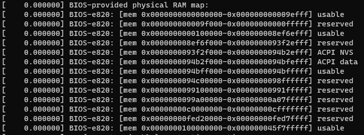
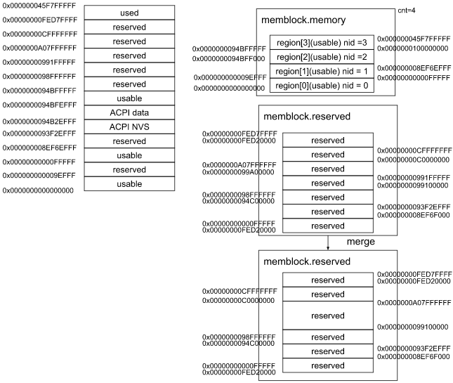
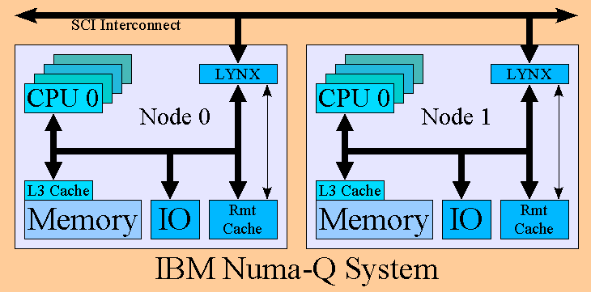
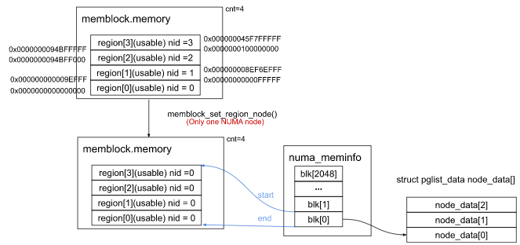
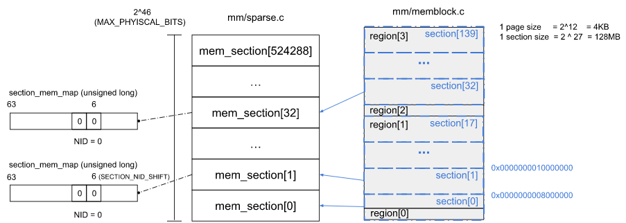
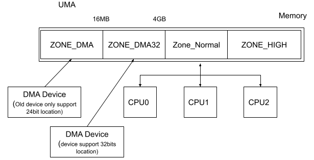

# Memory Management

## Detect phyiscal memory layout
For a memory device, there's detail information like memory type, storage size... marked on front side.<br>
But for operate system, those information should query from CPU.<br>

### Query memory information from CPU
The memory information was stored by BIOS when hardware bootup.<br>
The OS just get those information by BIOS interrupt.<br>
For x86 arch, there's three difference interrupt.<br>
```c
arch/x86/boot/main.c
void main(void) {
        ...
    detect_memory();
        ...
}

void detect_memory(void) {
    detect_memory_e820();
    detect_memory_e801();
    detect_memory_88();
}
```
* e820 interrupt
```
Input:
AX = E820h
EAX = 0000E820h
EDX = 534D4150h ('SMAP')
EBX = continuation value or 00000000h to start at beginning of map
ECX = size of buffer for result, in bytes (should be >= 20 bytes)
ES: DI -> buffer for result (see #00581)
int 0x15
```
```c
arch/x86/boot/memory.c
static void detect_memory_e820(void) {
        ...
    struct boot_e820_entry *desc = boot_params.e820_table;
        ...
    initregs(&ireg);
    ireg.ax = 0xe820;
    ireg.cx = sizeof(buf);
    ireq.edx = SMAP;
    ireg.di = (size_t)&buf;

    do {
        intcall(0x15, &ireg, &oreg);
        iref.ebx = oreg.ebx;
                ...
        *desc++ = buf;
        count++;
    } while(ireg.ebx && count < ARRAY_SIZE(boot_params.e820_table));

    boot_params.e820_entries = count;
}

arch/x86/kernel/e820.c
char *__init e820__memory_setup_default(void) {
        ...
    if (append_e820_table(boot_param.e820_table, boot_params.e820_entries) < 0) {
                ...
        e820_table->nr_entries = 0;
        e820__range_add(0, LOWMEMSIZE(), E820_TYPE_RAM);
        e820__range_add(HIGH_MEMORY, mem_size << 10, E820_TYPE_RAM);
    }
    e820__update_table(e820_table);
    return who;
}
```
Finally kernel will call function `e820__print_table()` to show the phyiscal memory layout
```c
void __init e820__print_table(char *who) {
    int i;

    for (i = 0; i < e820_table->nr_entriesl i++) {
        pr_info("%s: [mem %#018Lx-%#018Lx] ",
                who,
                e820_table->entries[i].addr,
                e820_table->entries[i].addr + e820_table->entries[i].size - 1);
        e820_print_type(e820_table->entries[i].type);
        pr_cont("\n");
    }
}
```
The `type` of `e820_table->entry` divided into
* E820_TYPE_RAM
* E820_TYPE_RESERVED
* E820_TYPE_ACPI
* E820_TYPE_NVS
* E820_TYPE_UNUSABLE
* E820_TYPE_PMEM
```c
static void __init e820_print_type(enum e820_type type) {
    switch(type) {
    case E820_TYPE_RAM:
    case E820_TYPE_RESERVED_KERN:   pr_cont("usable");                      break;
    case E820_TYPE_RESERVED:        pr_cont("reserved");                    break;
    case E820_TYPE_SOFT_RESERVED:   pr_cont("soft reserved");               break;
    case E820_TYPE_ACPI:            pr_cont("ACPI data");                   break;
    case E820_TYPE_NVS:             pr_cont("ACPI NVS");                    break;
    case E820_TYPE_UNUSABLE:        pr_cont("unusable");                    break;
    case E820_TYPE_PMEM:            /* Fall through: */
    case E820_TYPE_PRAM:            pr_cont("persistent (type %u)", type);  break;
    default:                        pr_cont("type %u", type);               break;
    }
}
```

* e801 interrupt
* e88 interrupt

## Memory Management
After get the information of phyiscal memory, Linux use `Memblock` mechanism to manage memory.<br>
```c
arch/x86/kernel/setup.c
void __init setup_arch(char **cmdline_p) {
            ...
    e820__memblock_setup();
            ...
    initmem_init();
            ...
    x86_init.pagong.pagetable_init();
}

arch/x86/kernel/e820.c
void __init e820__memblock_setup(void) {
            ...
    for (i = 0; i < e820_table->nr_entries; i++) {
        struct e820_entry *entry = &e820_table->entries[i];

        end = entry->addr + entry->size;
        if (end != (resource_size_t)end)
            continue;
        if (entry->type == E820_TYPE_SOFT_RESERVED)
            memblock_reserve(entry->addr, entry->size);

        if (entry->type != E820_TYPE_RAM && entry->type != E820_TYPE_RESERVED_KERN)
            continue;
        
        memblock_add(entry->addr, entry->size);
    }
}

int __init_memblock memblock_add(phys_addr_t base, phys_addr_t size) {
    phys_addr_t end = base + size -1;
    memblock_dbg("%s: [%pa-%pa] %pS\n", __func__,
        &base, &end, (void *)_RET_IP_);
    return memblock_add_range(&memblock.memory, base, size, MAX_NUMNODES, 0);
}

int __init_memblock memblock_reserve(phys_addr_t base, phys_addr_t size) {
    phys_addr_t end = base + size -1;
    memblock_dbg("%s: [%pa-%pa] %pS\n", __func__,
        &base, &end, (void *)_RET_IP_);
    return memblock_add_range(&memblock.reserved, base, size, MAX_NUMNODES, 0);
}
```

### Memory Architecture Initialize
#### NUMA (Non-Uniform Memory Access) <br>
<br>

```c
arch/x86/mm/numa.c
void __init initmem_init(void) {
    x86_numa_init();
}

void __init x86_numa_init(void) {
    if (!numa_off) {
#ifdef CONFIG_ACPI_NUMA
        if (!numa_init(x86_acpi_numa_init))
            return;
#endif
#ifdef CONFIG_AMD_NUMA
        if (!numa_init(amd_numa_init))
            return;
#endif
        numa_init(dummy_numa_init);
    }
}

static int __int numa_init(int (*init_func(void))) {
    int i;
    int ret;

    for (i = 0; i < MAX_LOCAL_APIC; i++)
            set_apicid_to_node(i, NUMA_NO_NODE);

    nodes_clear(numa_nodes_parsed);
    nodes_clear(node_possible_map);
    nodes_clear(node_online_map);
    memset(&numa_meminfo, 0, sizeof(numa_meminfo));
    WARN_ON(memblock_set_node(0, ULLONG_MAX, &memblock.memory,
                                MAX_NUMNODES));
    WARN_ON(memblock_set_node(0, ULLONG_MAX, &memblock.reserved,
                                MAX_NUMNODES));
    /* In case that parsing SRAT failed. */
    WARN_ON(memblock_clear_hotplug(0, ULLONG_MAX));
    numa_reset_distance();

    ret = init_func();
    if (ret < 0)
            return ret;

    /*
        * We reset memblock back to the top-down direction
        * here because if we configured ACPI_NUMA, we have
        * parsed SRAT in init_func(). It is ok to have the
        * reset here even if we did't configure ACPI_NUMA
        * or acpi numa init fails and fallbacks to dummy
        * numa init.
        */
    memblock_set_bottom_up(false);

    ret = numa_cleanup_meminfo(&numa_meminfo);
    if (ret < 0)
            return ret;
    numa_emulation(&numa_meminfo, numa_distance_cnt);

    ret = numa_register_memblks(&numa_meminfo);
    if (ret < 0)
            return ret;

    for (i = 0; i < nr_cpu_ids; i++) {
            int nid = early_cpu_to_node(i);

            if (nid == NUMA_NO_NODE)
                    continue;
            if (!node_online(nid))
                    numa_clear_node(i);
    }
    numa_init_array();

    return 0;
}
```
The register function `numa_register_memblks()` map `numa_meminfo.blk[]` to `memblock.memory.region[]` according to the NUMA node layout.<br>
The NUMA node layout may pass by ACPI, AMD or fack node if NUMA is not support ([dummy](#numa_dummy)).<br>
Then allocate memory (struct pglist_data) to each numa node.<br>

```c
static int __init numa_register_memblks(struct numa_meminfo *mi)
{
        int i, nid;

        /* Account for nodes with cpus and no memory */
        node_possible_map = numa_nodes_parsed;
        numa_nodemask_from_meminfo(&node_possible_map, mi);
                    ...
        for (i = 0; i < mi->nr_blks; i++) {
                struct numa_memblk *mb = &mi->blk[i];
                memblock_set_node(mb->start, mb->end - mb->start,
                                  &memblock.memory, mb->nid);
        }
                    ...
        /* Finally register nodes. */
        for_each_node_mask(nid, node_possible_map) {
                u64 start = PFN_PHYS(max_pfn);
                u64 end = 0;

                for (i = 0; i < mi->nr_blks; i++) {
                        if (nid != mi->blk[i].nid)
                                continue;
                        start = min(mi->blk[i].start, start);
                        end = max(mi->blk[i].end, end);
                }

                if (start >= end)
                        continue;

                /*
                 * Don't confuse VM with a node that doesn't have the
                 * minimum amount of memory:
                 */
                if (end && (end - start) < NODE_MIN_SIZE)
                        continue;

                alloc_node_data(nid);
        }

        /* Dump memblock with node info and return. */
        memblock_dump_all();
        return 0;
}
```

<h5 id=numa_dummy> Dummy </h5>

Dummy mechanism was introduced to the machine which not support NUMA arch (Use UMA arch) but enable NUMA feature in kernel.<br>
For compatibility, Kernel treat this like a special case of NUMA architecture : Only one node (fake node) NUMA arch.<br>
```c
static int __init dummy_numa_init(void) {
    printk(KERN_INFO "%s\n",
            numa_off ? "NUMA turned off" : "No NUMA configuration found");
    printk(KERN_INFO "Faking a node at [mem %#018Lx-%#018Lx]\n",
            0LLU, PFN_PHYS(max_pfn) - 1);
    node_set(0, numa_nodes_Parsed);
    numa_add_memblk(0, 0, PFN_PHYS(max_pfn));
    return 0;
}
```
can be seen [NUMA 之 System Descriptions](https://github.com/moooofly/MarkSomethingDown/blob/master/Linux/NUMA%20%E4%B9%8B%20System%20Descriptions.md)<br>
### Memory Model Initialize

```c
arch/x86/kernel/x86_init.c
struct x86_init_ops x86_init __initdata = {
        ...
    .paging = {
        .pagetable_init = native_pagetable_init,
    },
        ...
}

arch/x86/include/asm/pgtable_tables.h
#define native_pagetable_init paging_init

arch/x86/mm/init_64.c
void __init paging_init(void) {
    sparse_init();

    node_clear_state(0, N_MEMORY);
    node_clear_state(0, N_NORMAL_MEMORY);

    zone_sizes_init();
}
```
#### SPARSEMEM
```c
mm/sparse.c
void __init sparse_init(void) {
    unsigned long pnum_end, pnum_begin, map_count = 1;
    int nid_begin;

    memblocks_present();

    pnum_begin = first_present_section_nr();
    nid_begin = sparse_early_nid(__nr_to_section(pnum_begin));

    set_pageblock_order();

    for_each_present_section_nr(pnum_begin + 1, pnum_end) {
        int nid = sparse_early_nid(__nr_to_section(pnum_end));

        if (nid == nid_begin) {
            map_count++;
            continue;
        }

        sparse_init_nid(nid_begin, pnum_begin, pnum_end, map_count);
        nid_begin = nid;
        pnum_begin = pnum_end;
        map_count = 1;
    }
    /* cover the last node */
    sparse_init_nid(nid_begin, pnum_begin, pnum_end, map_count);
    vmemmap_populate_print_last();
}
```
<details><summary>memblocks_present</summary>
<p>

```c
static void __init memblocks_present(void) {
    unsigned long start, end;
    int i, nid;

    for_each_mem_pfn_range(i, MAX_NUMNODES, &start, &end, &nid)
        memory_present(nid, start, end);
}

static void __init memory_present(int nid, unsigned long start, unsigned long end) {
    unsigned long pfn;

#ifdef CONFIG_SPARSEMEM_EXTREME
    if (unlikely(!mem_section)) {
        unsigned long size, align;

        size = sizeof(struct mem_section *) * NR_SECTION_ROOTS;
        align = 1 << (INTERNODE_CACHE_SHIFT);
        mem_section = memblock_alloc(size, align);
        if (!mem_section)
            panic("%s: Failed to allocate %lu bytes align=0x%lx\n",
                    __func__, size, align);    
    }
#endif
    start &= PAGE_SECTION_MASK;
    mminit_validate_memmodel_limits(&start, &end);
    for (pfn = start; pfn < end; pfn += PAGES_PER_SECTION) {
        unsigned long section = pfn_to_section_nr(pfn);
        struct mem_section *ms;

        sparse_index_init(section, nid);
        set_section_nid(section, nid);

        ms = __nr_to_section(section);
        if (!ms->section_mem_map) {
            ms->section_mem_map = sparse_encode_early_nid(nid) |
                                    SECTION_IS_ONLINE;
            __section_mark_present(ms, section);
        }
    }
}
```
The initialize function `memory_present()` related the memory model and `memblock`.<br>

</p></details>
<details><summary>sparse_init_nid</summary>
<p>

After mapping mem_section and memblock, kernel allocate memory for mem_section.<br>
function `sparse_init_nid()` used to alloc memory by node, the total size is depend on `map_count` (means how many section in specific memblock.memory.region).<br>
```c
static void __init sparse_init_nid(int nid, unsigned long pnum_begin,
        unsigned long pnum_end,
        unsigned long map_count) {
    struct mem_section_usage *usage;
    unsigned long pnum;
    struct page *map;

    usage = sparse_early_usemaps_alloc_pddat_section(NODE_DATA(nid),
            mem_section_usage_size() * map_count);
    sparse_buffer_init(map_count * section_map_size(), nid);
    for_each_present_section_nr(pnum_begin, pnum) {
        unsigned long pfn = section_nr_to_pfn(pnum);

        if (pnum >= pnum_end)
            break;

        map = __populate_section_memmap(pfn, PAGES_PER_SECTION, nid, NULL, NULL);
                    ...
        sparse_init_one_section(__nr_to_section(pnum), pnum, map, usage, SECTION_IS_EARLY);
        usage = (void *) usage + mem_section_usage_size();
    }
                ...
}
```
To boost the node initialize process, kernel allocate all need memory by function `sparse_buffer_init()`.<br>
Then query enough memory per section by function `__populdate_section_memmap()`, finally assign those memory to mem_section by function `sparse_init_one_section`.<br>
```c
mm/sparse.c
static void __init sparse_buffer_init(unsigned long size, int nid) {
    phys_addr_t addr = __pa(MAX_DMA_ADDRESS);
    
    sparsemap_buf = memmap_alloc(size, section_map_size(), addr, nid, true);
    sparsemap_buf_end = sparsemap_buf + size;
}

struct page __init *__populate_section_memmap(unsigned long pfn,
        unsigned long nr_pages, int nid, struct vmem_altmap *altmap,
        struct dev_pagemap *pgmap) {
    unsigned long size = section_map_size();
    struct page *map = sparse_buffer_alloc(size);
    phys_addr_t addr = __pa(MAX_DMA_ADDRESS);

    if (map)
        return map;
                ...
}
```
</p></details>
<br>

#### Memory Zone
<br>
* ZONE_DMA :<br>
    This memory is reserved for some old DMA device which can support 24bits location.<br>
* ZONE_DMA32 :<br>
    x86_64 arch particular, reserved for DMA device can support 32bits localtion.<br>
* ZONE_NORMAL:<br>
    896MB for 32bits architecture, this zone will be map to kernel space of virtual memory directly.<br>
* ZONE_HIGH :<br>
    For some 32bits device with large storage, CPU can't access all physical address(because virtual address only 32bits). <br>
    Therefor, this zone will be map to virtual memory (0xF800000 ~ 0xFFFFFFFF) by dynamic mapping (vmalloc).<br>
see [ZONE_DMA32 - LWN.net](https://lwn.net/Articles/152462/) for more information.<br>

```c
include/linux/mmzone.h
enum zone_type {
#ifdef CONFIG_ZONE_DMA
    ZONE_DMA,
#endif
#ifdef CONFIG_ZONE_DMA32
    ZONE_DMA32,
#endif
    ZONE_NORMAL,
#ifdef CONFIG_HIGHMEM
    ZONE_HIGHMEM,
#endif
    ZONE_MOVEABLE,
#ifdef CONFIG_ZONE_DEVICE
    ZONE_DEVICE,
#endif
};

void __init zone_sizes_init(void)
{
    unsigned long max_zone_pfns[MAX_NR_ZONES];

    memset(max_zone_pfns, 0, sizeof(max_zone_pfns));

#ifdef CONFIG_ZONE_DMA
    // #define MAX_DMA_PFN   ((16UL * 1024 * 1024) >> PAGE_SHIFT)
    // PFN_PHYS(MAX_DMA_PFN) = 0x1000000 = 16M
    max_zone_pfns[ZONE_DMA]         = min(MAX_DMA_PFN, max_low_pfn); // PHYS_PFN()
#endif
#ifdef CONFIG_ZONE_DMA32
    //#define MAX_DMA32_PFN (1UL << (32 - PAGE_SHIFT))
    // PFN_PHYS(MAX_DMA32_PFN) = 0x100000000 = 4G
    max_zone_pfns[ZONE_DMA32]       = min(MAX_DMA32_PFN, max_low_pfn);
#endif
    //
    max_zone_pfns[ZONE_NORMAL]      = max_low_pfn; //0x45f800
#ifdef CONFIG_HIGHMEM
    max_zone_pfns[ZONE_HIGHMEM]     = max_pfn; //0x45f800
#endif
    free_area_init(max_zone_pfns);
}

void __init free_area_init(unsigned long *max_zone_pfn)
{
	unsigned long start_pfn, end_pfn;
	int i, nid, zone;
	bool descending;
			...
	/* Initialise every node */
	mminit_verify_pageflags_layout();
	setup_nr_node_ids();
	for_each_node(nid) {
		pg_data_t *pgdat;
				...
		pgdat = NODE_DATA(nid);
		free_area_init_node(nid);

		/* Any memory on that node */
		if (pgdat->node_present_pages)
			node_set_state(nid, N_MEMORY);
		check_for_memory(pgdat, nid);
	}

	memmap_init();
}

static void __init free_area_init_node(int nid)
{
	pg_data_t *pgdat = NODE_DATA(nid);
	unsigned long start_pfn = 0;
	unsigned long end_pfn = 0;

	/* pg_data_t should be reset to zero when it's allocated */
	WARN_ON(pgdat->nr_zones || pgdat->kswapd_highest_zoneidx);

	get_pfn_range_for_nid(nid, &start_pfn, &end_pfn);

	pgdat->node_id = nid;
	pgdat->node_start_pfn = start_pfn;
	pgdat->per_cpu_nodestats = NULL;

	if (start_pfn != end_pfn) {
		pr_info("Initmem setup node %d [mem %#018Lx-%#018Lx]\n", nid,
			(u64)start_pfn << PAGE_SHIFT,
			end_pfn ? ((u64)end_pfn << PAGE_SHIFT) - 1 : 0);
	} else {
		pr_info("Initmem setup node %d as memoryless\n", nid);
	}

	calculate_node_totalpages(pgdat, start_pfn, end_pfn);

	alloc_node_mem_map(pgdat);
	pgdat_set_deferred_range(pgdat);

	free_area_init_core(pgdat);
}
```


## Reference
[深入理解Linux內存管理](https://www.zhihu.com/column/c_1444822980567805952)
