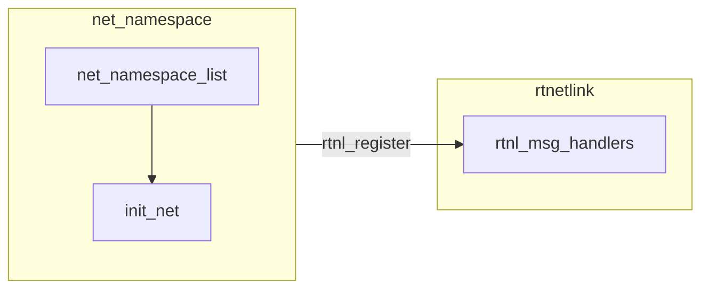
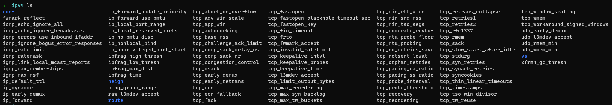

# NameSpace
Namespaces are a feature of the Linux kernel that partitions kernel resources such that one set of processes sees one set of resources while another set of processes sees a different set of resources.<br>
Linux provide 6 type of namespace.<br>
* [Process ID namespace](#PID)
* [Network namespace](#NET)
* Mount namespace
* UTS (UNIX Time-Sharing) namespace
* Interprocess Communication namespace
* USER ID namespace
```c
struct nsproxy {
    atomic_t count;
    struct uts_namespace *uts_ns;
    struct ipc_namespace *ipc_ns;
    struct mnt_namespace *mnt_ns;
    struct pid_namespace *pid_ns_for_children;
    struct net *net_ns;
    struct cgroup_namespace *cgroup_ns;
}
```
At the x86 platform, the default namespace as below<br>
```c
DEFINE_PER_CPU(struct task_struct *, current_task) ____cacheline_aligned = &init_task;
struct task_struct init_task = {
        .
        .
        .
    .nsproxy = &init_nsproxy,
        .
        .
        .
};

struct nsproxy init_nsproxy = {
    .count = ATOMIC_INIT(1),
    .uts_ns = &init_uts_ns,
    .ipc_ns = &init_ipc_ns,
    .mnt_ns = NULL,
    .pid_ns_for_children = &init_pid_ns,
    .net_ns = &init_net,
    .cgroup_ns = &init_cgroup_ns,
};
```

<h2 id=PID> PID </h2>
<h2 id=NET> NET </h2>
Network namespaces virtualize the network stack. On creation a network namespace contains only a loopback interface.<br>
Each network interface (physical or virtual) is present in exactly 1 namespace and can be moved between namespaces.<br>

### Initialize
```c
static int __init net_ns_init(void) {
    struct net_generic *ng;
#ifdef CONFIG_NET_NS
    net_cachep = kmem_cache_create("net_namespace", sizeof(struct net),
                    SMP_CACHE_BYTES,
                    SLAB_PANIC | SLAB_ACCOUNT, NULL);

    netns_wq = create_signlethread_workqueue("netns");
    if (!netns_wq)
        panic("Could not create netns workq");
#endif
    ng = net_alloc_generic();
    if (!ng)
        panic("Could not alloc generic netns");
    
    rcu_assign_pointer(init_net.gen, ng);
    
    down_write(&pernet_ops_rwsem);
    if (setup_net(&init_net, &init_user_ns))
        panic("Could not setup the initial network namespace");

    init_net_initialized = true;
    up_write(&pernet_ops_rwsem);

    if (register_pernet_subsys(&net_ns_ops))
        panic("Could not register network namespace subsystems");

    rtnl_register(PF_UNSPEC, RTM_NEWNSID, rtnl_net_newid, NULL,
        RTNL_FLAG_DOIT_UNLOCKED);
    rtnl_register(PF_UNSPEC, RTM_GETNSID, rtnl_net_getid, rtnl_net_dumpid,
        RTNL_FLAG_DOIT_UNLOCKED);
}
```
At the net name space initial process, Kernel register the first net `init_net` to `net_namespace_list` by function `setup_net()`.<br>
Then calling function `register_pernet_subsys()` to register net service operator `net_ns_ops` to the operator list `first_device` and execute init handler.<br>
```c
int register_pernet_subsys(struct pernet_operations *ops) {
    int error;
    down_write(&pernet_ops_rwsem);
    error = register_pernet_operations(first_device, ops);
    up_write(&pernet_ops_rwsem);
    return error;
}

static int register_pernet_operations(struct list_head *list, struct pernet_operations *ops) {
    int error;

    if (ops->id) {
        error = ida_alloc_min(&net_generic_ids, MIN_PERNET_OPS_ID,
                GFP_KERNEL);
        if (error < 0)
            return error;
        *ops->id = error;
        max_gen_ptrs = max(max_gen_ptrs, *ops->id + 1);
    }
    error = __register_pernet_operations(list, ops);
    if (error) {
        rcu_barrier();
        if (ops->id)
            ida_free(&net_generic_ids, *ops->id);
    }
    return error;
}

static int __register_pernet_operations(struct list_head *list,
                struct pernet_operations *ops) {
    struct net *net;
    int error;
    LIST_HEAD(net_exit_list);

    list_add_tail(&ops->list, list);
    if (ops->init || (ops->id && ops->size)) {
        for_each_net(net) {
            error = ops_init(ops, net);
            if (error)
                goto out_undo;
            list_add_tail(&net->exit_list, &net_exit_list);
        }
    }
    return 0;

out_undo:
    list_del(&ops->list);
    ops_pre_exit_list(ops, &net_exit_list);
    synchronize_rcu();
    ops_exit_list(ops, &net_exit_list);
    ops_free_list(ops, &net_exit_list);
    return error;
}

static struct pernet_operations __net_initdata net_ns_ops = {
    .init = net_ns_net_init,
    .exit = net_ns_net_exit,
};

static __net_init int net_ns_net_init(struct net *net) {
    net->ns.ops = &netns_operations;
    return ns_alloc_inum(&net->ns);
}

const struct proc_ns_operations netns_operations = {
    .name       = "net",
    .type       = CLONE_NEWNET,
    .get        = netns_get,
    .put        = netns_put,
    .install    = netns_install,
    .owner      = netns_owner,
};
```

At the end of net namespace initialize, register `rtnl` event `PF_UNSPEC` protocol handler by calling function `rtnl_register()`.<br>



So users can interaction with `net_namespace` module via `route netlink`
* [Get the process net namespace](./net_namespace.c)

### Interaction with USER

#### PROC
User can influence net namespace via `PROC` filesystem.<br>
Let's take a look about the `PROC` corresponding field `struct netns_xxx` in structure `net`. <br>
```c
struct net {
        .
        .
        .
    struct netns_core core;
    struct netns_mib;
    struct netns_packet;
    struct netns_unix;
    struct net_nexthop nexthop;
    struct netns_ipv4 ipv4;
#if IS_ENABLE(CONFIG_IPV6)
    struct netns_ipv6 ipv6;
#endif
#if IS_ENABLE(CONFIG_IEEE802154_6LOWPAN)
    struct netns_ieee802154_lowpan ieee802154_lowpan;
#endif
#if defined(CONFIG_IP_SCTP) || defined(CONFIG_IP_SCTP_MODULE)
    struct netns_sctp sctp;
#endif
#if defined(CONFIG_IP_DCCP) || defined(CONFIG_IP_DCCP_MODULE)
    struct netns_dccp dccp;
#endif
#ifdef CONFIG_NETFILTER
    struct netns_nf nf;
    struct netns_xt xt;
#if defined(CONFIG_NF_CONNTRACK) || defined(CONFIG_NF_CONNTRACK_MODULE)
    struct netns_ct ct;
#endif
#if defined(CONFIG_NF_TABLES) || defined(CONFIG_NF_TABLES_MODULE)
    struct netns_nftables nft;
#endif
        .
        .
        .
};
```
When the relative kernel module initialize process, the corresponding field when be assigend by the function `register_pernet_subsys()`. <br>
For example<br>
<details><summary>ipv4</summary>
<p>

```c
static int __init init_inet_pernet_ops(void)
{
    return register_pernet_subsys(&af_inet_ops);
}

static __net_initdata struct pernet_operations af_inet_ops = {
    .init = inet_init_net,
};

static __net_init int inet_init_net(struct net *net)
{
    /*
     * Set defaults for local port range
     */
    seqlock_init(&net->ipv4.ip_local_ports.lock);
    net->ipv4.ip_local_ports.range[0] =  32768;
    net->ipv4.ip_local_ports.range[1] =  60999;

    seqlock_init(&net->ipv4.ping_group_range.lock);
    /*
     * Sane defaults - nobody may create ping sockets.
     * Boot scripts should set this to distro-specific group.
     */
    net->ipv4.ping_group_range.range[0] = make_kgid(&init_user_ns, 1);
    net->ipv4.ping_group_range.range[1] = make_kgid(&init_user_ns, 0);

    /* Default values for sysctl-controlled parameters.
     * We set them here, in case sysctl is not compiled.
     */
    net->ipv4.sysctl_ip_default_ttl = IPDEFTTL;
    net->ipv4.sysctl_ip_fwd_update_priority = 1;
    net->ipv4.sysctl_ip_dynaddr = 0;
    net->ipv4.sysctl_ip_early_demux = 1;
    net->ipv4.sysctl_udp_early_demux = 1;
    net->ipv4.sysctl_tcp_early_demux = 1;
#ifdef CONFIG_SYSCTL
    net->ipv4.sysctl_ip_prot_sock = PROT_SOCK;
#endif

    /* Some igmp sysctl, whose values are always used */
    net->ipv4.sysctl_igmp_max_memberships = 20;
    net->ipv4.sysctl_igmp_max_msf = 10;
    /* IGMP reports for link-local multicast groups are enabled by default */
    net->ipv4.sysctl_igmp_llm_reports = 1;
    net->ipv4.sysctl_igmp_qrv = 2;

    return 0;
}
```
</p></details><br>

Those attribute define the network behavior and will be present as the file under `/proc/sys/net` director.<br>
Users can influence those behavior via modify context of corresponding file.<br>
The ipv4 attribute file path : `/proc/sys/net/ipv4`.<br>


### Network Isolation
Each net_namespace has its own network stack.<br>
For example, Wi-Fi call `ieee80211_deliver_skb()` to deliver received packet to kernel network stack.<br>
Driver assign its net_namespace(struct net_device) to `struct sk_buff *skb` then push to network stack.<br>
```c
static void ieee80211_deliver_skb(struct ieee80211_rx_data *rx) {
    struct ieee80211_sub_if_data *data = rx->sdata;
    struct net_device *dev = sdata->dev;
    struct sk_buff *skb, *xmit_skb;
    struct ethhdr *ehdr = (struct ethhdr *)rx->skb-data;
    struct sta_info *dsta;

    skb = rx->skb;
        .
        .
        .
    if (skb) {
        skb->protocol = eth_type_trans(skb, dev);
        ieee80211_deliver_skb_to_local_stack(skb,rx);
    }
        .
        .
        .
}

__be16 eth_type_trans(struct sk_buff *skb, struct net_device *dev) {
        .
        .
        .
    skb->dev = dev;
        .
        .
        .
}
```
Let's take a look when did the net_namespace of VAP(virtual access point) decided.
User can add new VAP via nl80211 service[ `NL80211_CMD_NEW_INTERFACE` ].<br>
```c
static int nl80211_new_interface(struct sk_buff *skb, struct genl_info *info) {
    struct cfg80211_registered_device *rdev = info->user_ptr[0];
        .
        .
        .
    wdev = rdev_add_virtual_intf(rdev, nla_data(info->attrs[NL80211_ATTR_IFNAME]), NET_NAME_USER, type, &params);
        .
        .
        .
}
```

<blockquote>

The instance `info->user_ptr[0]` was filled in nl80211 packet handle process<br>
<details><summary>nl80211 packet handle process</summary>
<p>

```c
static int __net_init genl_pernet_init(struct net *net) {
    struct netlink_kernel_cfg cfg = {
        .input = genl_rcv,
        .flags = NL_CFG_F_NONROOT_RECV,
    }
    net->genl_sock = netlink_kernel_create(net, NETLINK_GENERIC, &cfg);

    if (!net->genl_sock && net_eq(netm &init_net)) 
        panic("GENL : Cannot initialize generic netlink\n");
    
    if (!net->genl_sock)
        return -ENOMEM;
    return 0;
}

static int genl_family_rcv_msg(const struct genl_family *family, struct sk_buff *skb,
        struct nlmsghdr *nlh, struct netlink_ext_ack *extack) {
    const struct genl_ops *ops;
    struct net *net = sock_net(skb->sk);
    struct genl_info info;
        .
        .
        .
    genl_info_net_set(&info, net);
    memset(&info.user_ptr, 0, sizeof(info.user_ptr));
    if (family->pre_doit) {
        err = family->pre_doit(ops, skb, &info);
        if (err)
            goto out;
    }

    err = ops->doit(skb, &info);
        .
        .
        .
}

static int nl80211_pre_doit(const struct genl_ops *ops, struct sk_buff *skb, struct genl_info *info) {
    struct cfg80211_registered_device *rdev;
        .
        .
        .
    if (ops->internal_flags & NL80211_FLAG_NEED_WIPHY) {
        rdev = cfg80211_get_dev_from_info(genl_info_net(info), info);
        if (IS_ERR(rdev)) {
            if (rtnl)
                rtnl_unlock();
            return PTR_ERR(rdev);
        }
        info->user_ptr[0] = rdev;
    }
        .
        .
        .
}

static inline struct net *genl_info_net(struct genl_info *info) {
    return read_pnet(&info->_net);
}
```
</p></details></blockquote><br>

```c
static inline struct wireless_dev *rdev_add_virtual_intf(struct cfg80211_registered_device *rdev, char *name,
               unsigned char name_assign_type,
               enum nl80211_iftype type,
               struct vif_params *params)
{
    struct wireless_dev *ret;
    trace_rdev_add_virtual_intf(&rdev->wiphy, name, type);
    ret = rdev->ops->add_virtual_intf(&rdev->wiphy, name, name_assign_type,
                      type, params);
    trace_rdev_return_wdev(&rdev->wiphy, ret);
    return ret;
}
```
For the `cfg80211` wifi device register, the virtual interface create callback function is `ieee80211_add_iface()`
```c
const struct cfg80211_ops mac80211_config_ops = {
    .add_virtual_intf = ieee80211_add_iface,
        .
        .
        .
};

static struct wireless_dev *ieee80211_add_iface(struct wiphy *wiphy, const char *name, unsigned char name_assign_type,
        enum nl80211_iftype type, struct vif_params *params) {
    struct ieee80211_local *local = wiphy_priv(wiphy);
    struct wireless_dev *wdev;
    struct ieee80211_sub_if_data *sdata;
    int err;

    err = ieee80211_if_add(local, name, name_assign_type, &wdev, type, params);
        .
        .
        .
}

int ieee80211_if_add(struct ieee80211_local *local, const char *name,
        unsigned char name_assign_type, struct wireless_dev **new_wdev,
        enum nl80211_iftype type, struct vif_params *params) {
        .
        .
        .
    ndev = alloc_netdev_mqs(size + txq_size, name, name_assign_type, if_setup, txqs, 1);
    if (!ndev)
        return -ENOMEM;
    dev_net_set(ndev, wiphy_net(local->hw.wiphy));
        .
        .
        .
    sdata->dev = ndev;
        .
        .
        .
}
```
As the line `dev_net_set(ndev, wiphy_net(local->hw.wiphy))`, We can know that the net_namespace of VAP is same as the net_namespace of PHY.<br>
The net_namespace of PHY was decided when kernel detected phy existed.
```c
static inline struct wiphy *wiphy_new(const struct cfg80211_ops *ops, int sizeof_priv) {
    return wiphy_new_nw(ops, sizeof_priv, NULL);
}

struct wiphy *wiphy_new_nm(const struct cfg80211_ops *ops, int sizeof_priv, const char *requested_name) {
    static atomic_t wiphy_counter = ATOMIC_INIT(0);

    struct cfg80211_registered_device *rdev;
            .
            .
            .
    wiphy_net_set(&rdev->wiphy, &init_net);
}
```
The net_namespace of phy was assigned to `init_net` as default, that's why the VAP user created alway work on the main net_namespace.<br>
However, we also can change phy's net_namespace by nl80211 service [ `NL80211_CMD_SET_WIPHY_NETNS` ].<br>