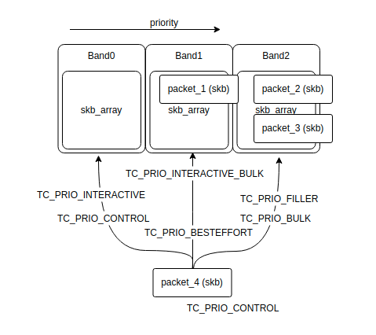
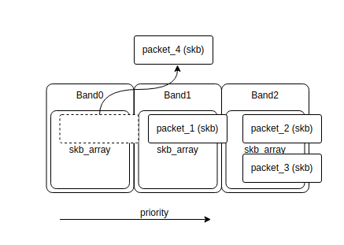

# Packet Schedule
`net/sched/Kconfig`
```
menuconfig NET_SCHED
    def_bool y
    select NET_SCH_FIFO
    select NET_SCH_FQ_CODEL
    ---help---
      When the kernel has several packets to send out over a network
      device, it has to decide which ones to send first, which ones to
      delay, and which ones to drop. This is the job of the queueing
      disciplines, several different algorithms for how to do this
      "fairly" have been proposed.

      If you say N here, you will get the standard packet scheduler, which
      is a FIFO (first come, first served). If you say Y here, you will be
      able to choose from among several alternative algorithms which can
      then be attached to different network devices. This is useful for
      example if some of your network devices are real time devices that
      need a certain minimum data flow rate, or if you need to limit the
      maximum data flow rate for traffic which matches specified criteria.
      This code is considered to be experimental.
```

```c
int register_netdevice(struct net_device *dev){
            .
            .
            .
    dev_init_scheduler(dev);
            .
            .
            .
}

void dev_init_scheduler(struct net_device *dev) {
    dev->qdisc = &noop_qdisc;
    netdev_for_each_tx_queue(dev, dev_init_scheduler_queue, &noop_qdisc);
    if (dev_ingress_queue(dev))
        dev_init_scheduler_queue(dev, dev_ingress_queue(dev), &noop_qdisc);
    timer_setup(&dev->watchdog_timer, dev_watchdog, 0);
}
```
## API
```c
static int __init pktsched_init(void) {
    int err;

    err = register_pernet_subsys(&psched_net_ops);
    if (err) {
        pr_err("pktsched_init: "
               "cannot initialize per netns operations\n");
        return err;
    }

    register_qdisc(&fq_codel_qdisc_ops);
    register_qdisc(&pfifo_qdisc_ops);
    register_qdisc(&bfifo_qdisc_ops);
    register_qdisc(&pfifo_head_drop_qdisc_ops);
    register_qdisc(&mq_qdisc_ops);
    register_qdisc(&noqueue_qdisc_ops);

    rtnl_register(PF_UNSPEC, RTM_NEWQDISC, tc_modify_qdisc, NULL, 0);
    rtnl_register(PF_UNSPEC, RTM_DELQDISC, tc_get_qdisc, NULL, 0);
    rtnl_register(PF_UNSPEC, RTM_GETQDISC, tc_get_qdisc, tc_dump_qdisc,
              0);
    rtnl_register(PF_UNSPEC, RTM_NEWTCLASS, tc_ctl_tclass, NULL, 0);
    rtnl_register(PF_UNSPEC, RTM_DELTCLASS, tc_ctl_tclass, NULL, 0);
    rtnl_register(PF_UNSPEC, RTM_GETTCLASS, tc_ctl_tclass, tc_dump_tclass,
              0);

    return 0;
}
```
### PROC
### Routing Family Netlink
<details><summary>Add New Queue-Discipline</summary>
<p>

The queue-discipline used to customize outgoing packet policy usually.<br>
For the incoming packet, Queue-Discipline(`TC_H_INGRESS`) can only setup filter to drop specific packet.<br>

```c
static int tc_modify_qdisc(struct sk_buff *skb, struct nlmsghdr *n,
		struct netlink_ext_ack *exctack) {
	struct net *net = sock_net(skb->sk);
	struct tcmsg *tcm;
	struct nlattr *tac[TCA_MAX + 1];
	struct net_device *dev;
	struct Qdisc *q, *p; // p used to store parent qdisc.
	u32 clid;

	err = nlmsg_parse_deprecated(n, sizeof(*tcm), tac, TCA_MAC, rtm_tca_policy, extack);

	tcm = nlmsg_data(n);
	clid = tcm->tcm_parent;
	dev = __dev_get_by_index(net, tcm->tcm_ifindex);

	if (clid) {
		if (clid != TC_H_ROOT) {
			if (clid != TC_H_INGRESS) {
				p = qsidc_lookup(dev, TC_H_MAJ(clid));
				if (!p) {
					NL_SET_ERR_MSG(extack, "Failed to find specified qdisc");
					return -ENOENT;
				}
				q = qdisc_leaf(p, clid);
			} else if (dev_ingress_queue_create(dev)) {
				q = dev_ingress_queue(dev)->qdisc_sleeping;
			}
		} else {
			q = dev->qdisc;
		}
		// It may be default qdisc. ignore it.
		if (q && q->handle == 0)
			q = NULL;
	}

	if (!q || !tcm->tcm_handle || q->handle != tcm->tcm_handle) {
		if (tcm->tcm_handle) {
			q = qdisc_lookup(dev, tcm->tcm_handle);
			if (!q)
				goto create_n_graft;
		}
	}

create_n_graft:
	if (clid == TC_H_INGRESS) {
		if (dev_ingress_queue(dev)) {
			q = qdisc_create(dev, dev_ingress_queue(dev), p,
				tcm->tcm_parent, tcm->tcm_parent,
				tca, &err, extack);
		}
	} else {
		struct netdev_queue *dev_queue;
		if (p && p->ops->cl_ops && p->ops->cl_ops->select_queue)
			dev_queue = p->ops->cl_ops->select_queue(p, tcm);
		else if (p)
			dev_queue = p->dev_queue;
		else
			dev_queue = netdev_get_tx_queue(dev, 0);

		q = qdisc_create(dev, dev_queue, p, tcm->tcm_parent,
			tcm->tcm_handle, tca, &err, extack);
	}
	if (q == NULL) {
		if (err == -EAGAIN)
			goto replay;
		return err;
	}
graft:
	err = qdisc_graft(dev, p, skb, n, clid, q, NULL, extack);
	if (err) {
		if (q)
			qdisc_put(p);
		return err;
	}
	return 0;
}
```
<blockquote>
<details><summary>qdisc_create()</summary>
<p>

Function `qdisc_create()` create a new queueing-discipline with the identity `tcm->tcm_handle`.<br>
The policy of this queueing-discipline was specified by the netlink parameter `TCA_KIND`.<br>
At the end, new queueing-discipline will be add to `net_device` by function `qdisc_hash_add()`.<br>
```c
static struct Qdisc *qdisc_create(struct net_device *dev,
		struct netdev_queue *dev_queue,
		struct Qdisc *p, u32 parent, u32 handle,
		struct nlattr **tca, int *errp,
		struct netlink_ext_ack *extack) {
	struct nlattr *kind = tca[TCA_KIND];
	struct Qdisc *sch;
	struct Qdisc_ops *ops;
	struct qdisc_size_table *stab;

	ops = qdisc_lookup_ops(kind);
	sch = qdisc_alloc(dev_queue, ops, extack);

	sch->parent = parent;
	if (handle == TC_H_INGRESS) {
		sch->flags |= TCQ_F_INGRESS;
		handle = TC_H_MAKE(TC_H_INGRESS, 0);
	} else {
		if (handle == 0)
			handle = qdisc_alloc_handle(dev);
		if (!netif_is_multiqueue(dev))
			sch->flags |= TCA_F_ONETXQUEUE;
	}
	sch->handle = handle;
		...
	qdisc_hash_add(sch, false);
}
```
The function `qdisc_lookup_ops()` used to search the corresponding queueing-discipline which registered by function `register_qdisc()` through the specified `TCA_KIND`.<br>
</p></details>
<details><summary>qdisc_graft()</summary>
<p>

```c
static int qdisc_graft(struct net_device *dev, struct Qdisc *parent,
		struct sk_buff *skb, struct nlmsghdr *n, u32 classid,
		struct Qdisc *new, struct Qdisc *old,
		struct netlink_ext_ack *extack) {
	if (parent == NULL) {
		unsigned int i, num_q, ingress;

		ingress = 0;
		if (dev->flags & IFF_UP)
			dev_deactivate(dev);

		qdisc_offload_graft_root(dev, new, old, extack);

		if (new && new->ops->attach)
			goto skip;

		for (i = 0; i < num_q; i++) {
			struct netdev_queue *dev_queue = dev_ingress_queue(dev);

			if (!ingress)
				dev_queue = netdev_get_tx_queue(dev, i);
			old = dev_graft_qdisc(dev_queue, new);
		}
			...
		if (dev->flags & IFF_UP)
			dev_activate(dev);
	}
		...
}
```
Function `dev_graft_qdisc()` used to restore new queueing-discipline to `net_device->_tx[].qdisc_sleeping`.<br>
And the function `dev_activate()` replace `net_device->_tx[].qdisc` from `qdisc_sleeping`.<br>
</p></details>
</blockquote>

After function `qdisc_graft()` success executed, the queueing-discipline of device replaced, the event `RTM_NEWQDISC` handle was done.<br>
</p>
</details>

## Packet Schdule

If device queueing-discipline was not specified, the default queueing-discipline (usually be `pfifo_fast_ops`) be assigned by function `attach_default_qdiscs()`.<br>
```c
void dev_activate(struct net_device *dev) {
		...
	if (dev->qdisc == &noop_qdisc)
		attach_default_qdiscs(dev);
		...
}
```
When kernel call function `dev_queue_xmit()` to send packets, those packet will be reschedule if the queueing-discipline implement `enqueue()`.
```c
static int __dev_queue_xmit(struct sk_buff *skb, struct net_device *sb_dev) {
	struct Qdisc *q;
		...
	q = rcu_dereference_bh(txq->qdisc);
	if (q->enqueue) {
		rc = __dev_xmit_skb(skb, q, dev, txq);
		goto out;
	}
		...
}

static inline int __dev_xmit_skb(struct sk_buff *skb, struct Qdisc *q,
		struct net_device *dev, struct netdev_queue *txq) {
		...
    if (q->flags & TCQ_F_NOLOCK) {
        rc = q->enqueue(skb, q, &to_free) & NET_XMIT_MASK;
        qdisc_run(q);

        if (unlikely(to_free))
            kfree_skb_list(to_free);
        return rc;
    }
    
	if (unlikely(test_bit(__QDISC_STATE_DEACTIVATED, &q->state))) {
		__qdisc_drop(skb, &to_free);
		rc = NET_XMIT_DROP;
	} else if ((q->flags & TCQ_F_CAN_BYPASS) && !qdisc_qlen(q) &&
			qdisc_run_begin(q)) {
		qdisc_bstats_update(q, skb);

		if (sch_direct_xmit(skb, q,dev, txq, root_lock, true)) {
			if (unlikely(contended)) {
				spin_unlock(&q->busylock);
				contended = false;
			}
			__qdisc_run(q);
		}
		qdisc_run_end(q);
		rc = NET_XMIT_SUCCESS;
	} else {
		rc = dev_qdisc_enqueue(skb, q, &to_free, txq);
		if (qdisc_run_begin(q)) {
			if (unlikely(contended)) {
				spin_unlock(&q->busylock);
				contended = false;
			}
			__qdisc_run(q);
			qdisc_run_end(q);
		}
	}
		...
}
```
If the bitmap `TCQ_F_CAN_BYPASS` of flag of `Qdisc` is set, packet send direct without queueing, or enqueue by function `dev_qdisc_enqueue()` if not .
The more detailed information is below.<br>
After packet enqueue, execute `__qdisc_run()` -> `qdisc_restart()` -> `dequeue_skb()`.<br>
```c
static struct sk_buff *dequeue_skb(struct Qdisc *q, bool *validate, int *packets) {
	const struct netdev_queue *txq = q->dev_queue;
	struct sk_buff *skb = NULL;

	*packets = 1;
	if (unlikely(!skb_queue_empty(&q->gso_skb))) {
		skb = skb_peek(&q->gso_skb);
			...
        goto trace;
	}

	*validate = true;

	if ((q->flags & TCQ_F_ONETXQUEUE) && netif_xmit_frozen_or_stopped(txq))
        return skb;

    skb = qdisc_dequeue_skb_bad_txq(q);
    if (unlikely(skb)) {
        if (skb == SKB_XOFF_MAGIC)
            return NULL;
        goto bulk;
    }
    skb = q->dequeue(q);
    if (skb) {
bulk:
        if (qdisc_may_bulk(q))
            try_bulk_dequeue_skb(q, skb, txq, packets);
        else
            try_bulk_dequeue_skb_slow(q, skb, txq, packets);
    }
trace:
    trace_qdisc_dequeue(q, txq, *packets, skb);
    return skb;
}
```
Kernel check the `gso_skb` and `skb_bad_txq` queue, if those queues is not empty, kernel will handle at this time.<br>
Then the enqueued packet need to wait the next time call `qdisc_restart()`.<br>

The `gso_skb` queue used to store the unsuccess sending packet by calling fucntion `dev_requeue_skb()`.<br>
```c
bool sch_direct_xmit(struct sk_buff *skb, struct Qdisc *q, struct net_device *dev,
        struct netdev_queue *txq, spinlock_t *root_lock, bool validate) {
            ...
    if (!dev_xmit_complete(ret)) {
        if (unlikely(ret != NETDEV_TX_BUSY))
            net_warn_ratelimited("BUG %s code %d qlen %d\n", dev->name, ret, q->q.qlen);

        dev_requeue_skb(skb, q);
        return false;
    }
    return true;
}

static inline void dev_requeue_skb(struct sk_buff *skb, struct Qdisc *q) {
        ...
    while(skb) {
        struct sk_buff *next = skb->next;

        __skb_queue_tail(&q->gso_skb, skb);
            ...
        skb = next;
    }
    __netif_schedule(q);
}
```
## Queueing-Discipline
<details><summary>pfifo_fast</summary>

`pfifo_fast` is the kernel default queueing-discipline method.<br>

<p>

```c
static int pfifo_fast_enqueue(struct sk_buff *skb, struct Qdisc *qdisc,
		struct sk_buff **to_free) {
	int band = prio2band[skb->priority & TC_PRIO_MAX];
	struct pfifo_fast_priv *priv = qdisc_priv(qdisc);
	struct skb_array *q = band2list(priv, band);
	unsigned int pkt_len = qdisc_pkt_len(skb);
	int err;

	err = skb_array_produce(q, skb);

	if (unlikely(err)) {
		if (qdisc_is_percpu_stats(qdisc))
			return qdisc_drop_cpu(skb, qdisc, to_free);
		else
			return qdisc_drop(skb, qdisc, to_free);
	}

	qdisc_update_stats_at_enqueue(qdisc, pkt_len);
	return NET_XMIT_SUCCESS;
}
```


```c
static int pfifo_fast_dequeue(struct Qdisc *qdisc) {
	struct pfifoa_fast_priv *priv = qdisc_priv(qdisc);
	struct sk_buff *skb = NULL;
	bool need_retry = true;
	int band;

retry:
	for (band = 0; band < PFIFO_FAST_BANDS && !skb; band++) {
		struct skb_array *q = band2list(priv, band);

		if (__skb_array_emptry(q))
			continue;
		skb = __skb_array_consume(q);
	}
		...
	return skb;
}
```
</p></details>
