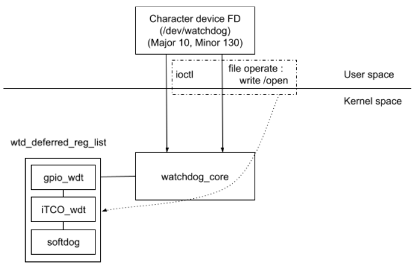

# Watchdog
* Kernel space watchdog
* User space watchdog

## User space watchdog
No matter user space or kernel space watchdog, the dog is executed at the kernel space.<br>
The difference is the dog enabled, feed and disabled is controlled by user space application when enable user space watchdog.<br>
Usually the application is busybox-watchdog, or some property application.<br>
For moxa, using busybox-watchdog.<br>

### Busybox-watchdog
Busybox-watchdog control kernel dog via ioctl (the only way provided by kernel.)<br>
```c
busybox/miscutils/watchdog.c
int watchdog_main(int argc UNUSED_PARM, char **argv)
{
                ...
        ioctl_or_warn(3, WDIOC_SETOPTIONS, (void*) &enable);
        ioctl_or_warn(3, WDIOC_SETTIMEOUT, &htimer_duration);
                ...
}

int FAST_FUNC bb_ioctl_or_warn(int fd, unsigned request, void *argp, const char *ioctl_name)
{
        int ret;

        ret = ioctl(fd, request, argp);
        if (ret < 0)
                bb_simple_perror_msg(ioctl_name);
        return ret;
}
```

### Linux kernel API
The kernel watchdog feature is defined at `linux/driver/watchdog`.<br>
```c
static int __init watchdog_init(void)
{
        int err;

        watchdog_class = class_create(THIS_MODULE, "watchdog");
        if (IS_ERR(watchdog_class)) {
                pr_err("couldn't create class\n");
                return PTR_ERR(watchdog_class);
        }

        err = watchdog_dev_init();
        if (err < 0) {
                class_destroy(watchdog_class);
                return err;
        }
        printk(KERN_ERR "%s\n", __func__);
        watchdog_deferred_registration();
        return 0;
}

static int __init watchdog_deferred_registration(void)
{
        mutex_lock(&wtd_deferred_reg_mutex);
        wtd_deferred_reg_done = true;
        printk(KERN_ERR "%s\n", __func__);
        while (!list_empty(&wtd_deferred_reg_list)) {
                struct watchdog_device *wdd;

                wdd = list_first_entry(&wtd_deferred_reg_list,
                                       struct watchdog_device, deferred);
                list_del(&wdd->deferred);
                __watchdog_register_device(wdd);
        }
        mutex_unlock(&wtd_deferred_reg_mutex);
        return 0;
}
```
Linux has lots of watchdog provided by different hardware `it87_wdt`, `iTCO_wdt` and sure `softdog`...<br>
The list `wtd_deferred_reg_list` record the supported watchdog.<br>
Those watchdog implemented it's own initialize function and call the function `watchdog_register_device()` to register itself to watchdog core.<br>
```c
int watchdog_register_device(struct watchdog_device *wdd)
{
        int ret;

        mutex_lock(&wtd_deferred_reg_mutex);
        if (wtd_deferred_reg_done)
                ret = __watchdog_register_device(wdd);
        else
                ret = watchdog_deferred_registration_add(wdd);
        mutex_unlock(&wtd_deferred_reg_mutex);
        return ret;
}
```
After all supported watchdog initialize, watchdog core will register all to kernel by calling `watchdog_deferred_registration()`.<br>
`watchdog_deferred_registration()` -> `__watchdog_register_device()` -> `watchdog_dev_register()`.<br> 
```c
include/linux/miscdevice.h
#define WATCHDOG_MINOR          130     /* Watchdog timer     */

driver/watchdog/watchdog_dev.c
static const struct file_operations watchdog_fops = {
    .owner          = THIS_MODULE,
    .write          = watchdog_write,
    .unlocked_ioctl = watchdog_ioctl,
    .open           = watchdog_open,
    .release        = watchdog_release,
};

static struct miscdevice watchdog_miscdev = {
    .minor  = WATCHDOG_MINOR,
    .name   = "watchdog",
    .fops   = &watchdog_fops,
};

int watchdog_dev_register(struct watchdog_device *wdd)
{
        int err, devno;

        if (wdd->id == 0) {
                old_wdd = wdd;
                watchdog_miscdev.parent = wdd->parent;
                err = misc_register(&watchdog_miscdev);
                        ...
        }

        /* Fill in the data structures */
        devno = MKDEV(MAJOR(watchdog_devt), wdd->id);
        cdev_init(&wdd->cdev, &watchdog_fops);
        wdd->cdev.owner = wdd->ops->owner;

        /* Add the device */
        err  = cdev_add(&wdd->cdev, devno, 1);
                ...
        return err;
}
```
The function `misc_register()` is used to register a service with minor number to miscellaneous device (MAJOR == 10).<br>
For now, it's easy to understand the mechanism of linux watchdog :<br>
<br>
    P.S. Some watchdog doesn't follow the rule of watchdog_core, like `it87_wdt`, it call `misc_register()` to register watchdog service(minor == 130) directly instead of via the watchdog_core provided API `watchdog_register_device()`...<br>

## Watchdogs
* iTCO_wdt
    ```config
    config ITCO_WDT
            tristate "Intel TCO Timer/Watchdog"
            depends on (X86 || IA64) && PCI
            select WATCHDOG_CORE
            depends on I2C || I2C=n
            select LPC_ICH if !EXPERT
            select I2C_I801 if !EXPERT && I2C
            ---help---
            Hardware driver for the intel TCO timer based watchdog devices.
            These drivers are included in the Intel 82801 I/O Controller
            Hub family (from ICH0 up to ICH10) and in the Intel 63xxESB
            controller hub.

            The TCO (Total Cost of Ownership) timer is a watchdog timer
            that will reboot the machine after its second expiration. The
            expiration time can be configured with the "heartbeat" parameter.

            On some motherboards the driver may fail to reset the chipset's
            NO_REBOOT flag which prevents the watchdog from rebooting the
            machine. If this is the case you will get a kernel message like
            "failed to reset NO_REBOOT flag, reboot disabled by hardware".

            To compile this driver as a module, choose M here: the
            module will be called iTCO_wdt.
    ```
    The iTCO register can refer the chapter `System Management TCO register` of [Intel 9 Series Chipset Family Platform Controller Hub (PCH) datasheet](https://www.intel.com/content/dam/www/public/us/en/documents/datasheets/9-series-chipset-pch-datasheet.pdf).<br>

* it87_wdt
    ```config
    config IT87_WDT
        tristate "IT87 Watchdog Timer"
        depends on X86
        ---help---
          This is the driver for the hardware watchdog on the ITE IT8702,
          IT8712, IT8716, IT8718, IT8720, IT8721, IT8726 and IT8728
          Super I/O chips.

          If the driver does not work, then make sure that the game port in
          the BIOS is enabled.

          This watchdog simply watches your kernel to make sure it doesn't
          freeze, and if it does, it reboots your computer after a certain:ㄅ
          amount of time.

          To compile this driver as a module, choose M here: the module will
          be called it87_wdt.
    ```
    The it87 watchdog related register can refer the chapter `8.11 GPIO Configuration Registers` of [IT8783E/F Preliminary Specification V0.5 (For A Version)](https://www.ite.com.tw/uploads/product_download/IT8783_A_V0.5_062510.pdf).<br>
* softdog
Softdog is a platform independent watchdog implementation, The mechanism of softdog is `timer_list` operation.<br>
```c
static struct timer_list watchdog_ticktock = 
        TIMER_INITIALIZER(watchdog_fire, 0 ,0);

static struct watchddog_ops softdog_ops = {
    .owner = THIS_MODULE,
    .start = softdog_pong,
    .stop = softdog_stop,
    .set_timeout = softdog_set_timeout,
};

static int softdog_ping(struct watchdog_device *w) {
    mod_timer(&watchdog_ticktock, jiffies+(w->timeout*HZ));
    return 0;
}

static int soft_stop(struct watchdog_device *w) {
    del_timer(&watchdog_ticktock);
    return 0;
}
```
The reboot function wii be :<br>
```c
static void watchdog_fire(unsigned long data) {
    if (soft_noboot)
        pr_crit("Triggered - Reboot ignored\n");
    else if (soft_panic) {
        pr_crit("Initiating panic\n");
        panic("Software Watchdog Timer expired");
    } else {
        pr_crit("Initiating system reboot\n");
        emergency_restart();
        pr_crit("Reboot didn't ????\n");
    }
}
```